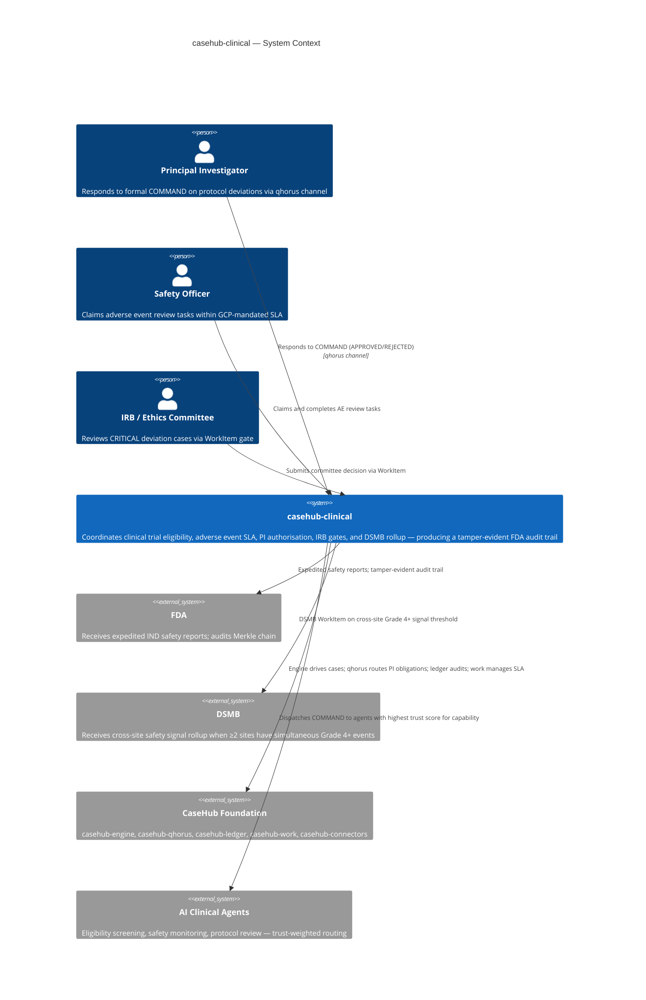
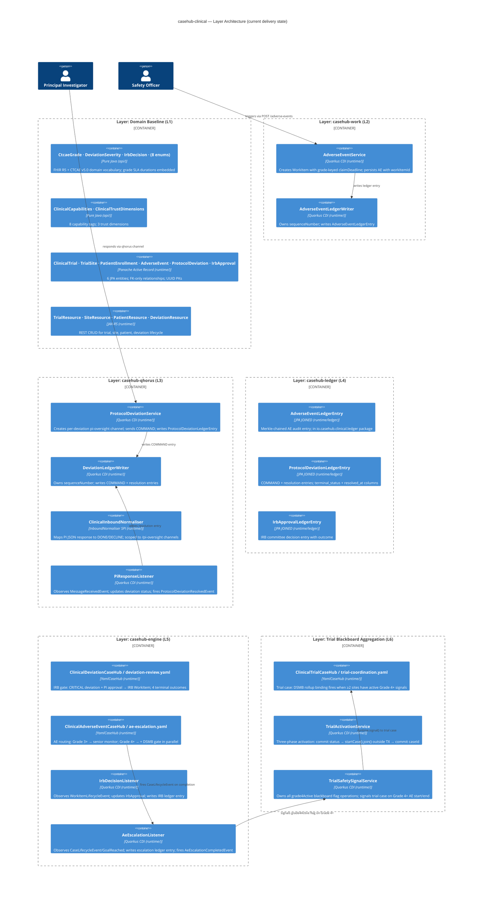
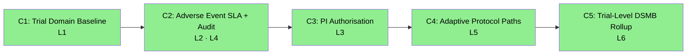

# casehub-clinical — ARC42STORIES.MD

**Version:** 0.1 (initial generation)
**Date:** 2026-06-02
**Profile:** [Arc42Stories CaseHub Profile](../parent/docs/arc42stories-casehub-profile.md)
**Spec:** [Arc42Stories Specification](../parent/docs/arc42stories-spec.md)
**Status:** Layers 1–8 complete. All Chapters complete.

---

## §1 Introduction and Goals

### Description

`casehub-clinical` is an **agentic harness for clinical trial coordination** built on the CaseHub platform foundation. It coordinates eligibility screening agents, safety monitoring agents, PI authorisation gates, and IRB approval gates — producing an FDA-compliant, GDPR-aware, independently verifiable audit trail under GCP/ICH E6(R3).

Clinical trials impose the strictest regulated AI requirements of any domain. Every agent decision must be traceable. Every protocol deviation must carry formal PI accountability. Every adverse event has a hard reporting deadline with documented escalation. `casehub-clinical` demonstrates that CaseHub's accountability layer satisfies these requirements structurally — where workflow-based LLM systems cannot provide equivalent compliance guarantees.

The CaseHub foundation has no domain knowledge. It knows about cases, bindings, workers, commitments, trust, and audit. `casehub-clinical` provides the clinical trial domain logic: what a trial protocol is, how a site manages patient enrollment, how adverse events escalate, and how the FDA audit trail is constructed.

**Baseline:** [ClinicalAgent arXiv 2404.14777](https://arxiv.org/abs/2404.14777) — open-source peer-reviewed baseline. See `docs/use-case-analysis.md §8.1` in casehub-parent for the GCP compliance gap analysis.

### Stakeholders

| Stakeholder | Interest |
|---|---|
| Principal Investigator (PI) | Receives formal COMMAND on protocol deviations; formal obligation with GCP-compliant deadline |
| Sponsor | Receives MAJOR deviation notifications; informed of trial safety signal escalations |
| Safety Officer | Claims adverse event review tasks within GCP-mandated SLA |
| DSMB | Receives cross-site safety signal rollup via trial-level case |
| FDA Auditor | Independently verifies Merkle-chained audit trail; every decision traceable |
| IRB / Ethics Committee | Reviews CRITICAL deviation cases via WorkItem gate with 72h deadline |
| AI Clinical Agents | Execute eligibility screening, safety monitoring, protocol review with trust-weighted routing |
| CaseHub Platform Team | Validates foundation correctness under regulated AI requirements |

### Quality Goals

| Priority | Goal | Scenario |
|---|---|---|
| 1 | ICH E6(R3) SLA compliance | Grade 3/4 AE reported within 24h; Grade 5 within 1h internal; Grade 1/2 within 7 days |
| 2 | Tamper-evident FDA audit | Every AE, deviation COMMAND, IRB decision, and escalation is Merkle-chained and independently verifiable |
| 3 | Formal PI accountability | Every CRITICAL deviation carries a named PI obligation with a deadline the platform escalates if missed |
| 4 | Adaptive safety routing | AE severity determines which gates fire — not hardcoded routing; IRB gate suspends case until committee decides |
| 5 | Cross-site DSMB pattern detection | Trial-level case detects simultaneous Grade 4+ signals across ≥2 sites without any site agent having global visibility |

### Artifact Schema

PREFIX: `CLI`

| Artifact type | Format | Example | Where it lives |
|---|---|---|---|
| Improvement log entry | `CLI-NNN` | `CLI-042` | `docs/PROGRESS.md` |
| Issue | `#NNN` or `casehubio/clinical#NNN` | `#52`, `casehubio/clinical#52` | GitHub Issues |
| Garden entry | `GE-YYYYMMDD-XXXXXX` | `GE-20260531-ed2f7a` | `~/.hortora/garden/` |
| Protocol | `PP-YYYYMMDD-XXXXXX` | `PP-20260530-49856c` | `casehub-parent/docs/protocols/` |
| ADR | `ADR-NNNN` | `ADR-0004` | `docs/adr/` (project repo) |
| Blog entry | `YYYY-MM-DD-[initials]NN-title` | `2026-05-23-mdp01-layer-5-engine-arrives` | workspace `blog/` |
| Design spec | `YYYY-MM-DD-topic-design` | `2026-05-22-irb-gate-ae-escalation-design` | `docs/specs/` (project repo) |

---

## §2 Constraints

### Platform

| Constraint | Value | Rationale |
|---|---|---|
| Java version | Java 21 (on Java 26 JVM) | Java 21 language features; JVM 26 for performance |
| Framework | Quarkus 3.32.2 | Ecosystem-wide version lock; bump all projects together |
| Native target | GraalVM 25 | Production native image target |
| Build tool | Maven (not `./mvnw`) | Wrapper not configured; use system `mvn` |

```bash
JAVA_HOME=$(/usr/libexec/java_home -v 26) mvn clean install
```

### Architectural

- **Production-first constraint:** Before writing any class, apply: "Would this class exist in a production system built to this layer and no further?" If no — do not build it.
- **Layering rule:** If a capability requires knowledge of clinical trial protocols, GCP, FDA IND, or patient consent, it belongs here. If it is purely about cases, commitments, trust, or audit records, it belongs in the foundation.
- **Two-module structure:** `api/` (pure Java, zero framework — enums, constants, SPIs, CDI events) + `runtime/` (Quarkus app — JPA entities, REST, services, Flyway). Protocol: `module-tier-structure.md`.
- **Active Record exception:** No downstream JPA consumers exist for this application-tier repo. Panache Active Record entities in `runtime/` serve directly as domain objects. `api/` holds only enums and constants — no service interfaces (contrast with AML, which adds service interfaces to `api/`). CDI displacement via `@DefaultBean` does not apply; each layer adds new services.

### Compliance Standards

| Standard | Governs |
|---|---|
| ICH E6(R3) GCP | Trial conduct, adverse event reporting obligations, PI responsibilities |
| CTCAE v5.0 | Grade 1–5 definitions and severity thresholds; SLA assignments per grade |
| 21 CFR Part 312 | FDA IND requirements; expedited safety reporting; sponsor obligations |
| FHIR R5 ResearchStudy / ResearchSubject | Domain model field names and entity relationships |
| GDPR Art.17 | Patient consent withdrawal and data erasure |

### Dependencies

All casehubio artifacts at `0.2-SNAPSHOT` resolved from GitHub Packages. The `casehub-parent` BOM owns version alignment. `casehub-clinical` may not commit to peer repo directories — each has its own Claude session.

---

## §3 Context and Scope



### Boundary Rules

**casehub-clinical owns:** clinical trial domain vocabulary (CtcaeGrade, DeviationSeverity, IrbDecision); GCP SLA policy implementation; FDA audit trail requirements; adverse event routing policies; PI authorisation channel management; IRB committee assignment policy; DSMB rollup binding definition; trial activation and site management.

**Foundation owns:** case lifecycle (engine); agent communication mesh and obligation tracking (qhorus); Merkle audit chain and trust scoring (ledger); human task lifecycle and SLA (work); outbound message delivery (connectors).

See `../parent/docs/PLATFORM.md` Capability Ownership table for the full boundary map.

---

## §4 Solution Strategy

### Core Architectural Patterns

| Tier | Pattern blend | Clinical expression |
|---|---|---|
| Domain | **Hexagonal** | `api/` holds pure Java SPIs; `runtime/` holds all Quarkus wiring |
| Persistence | **Active Record (exception)** | No downstream JPA consumers; Panache entities serve as domain objects directly — no POJO mapping layer |
| Orchestration | **Event-Driven + ACM** | CDI async events chain layers; engine evaluates binding conditions against accumulated CaseContext |
| Cross-cutting | **Strategy + Observer** | `DeviationResponsePolicy`, `AdverseEventEscalationPolicy`, `IrbCommitteeAssignmentPolicy` SPIs; `@ObservesAsync` for ledger capture |

### Layer Taxonomy

**Before L1:** direct `Entity.persist()` calls with no accountability, no SLA, no formal obligation, no audit trail.
**After L1–L6:** the same `POST /adverse-events` call creates a WorkItem with a grade-keyed SLA deadline, writes a Merkle-chained ledger entry, and triggers an engine case that routes by severity — Grade 3+ to senior monitors, Grade 4+ additionally to DSMB, Grade 5 unexpected to FDA IND reporting path.

| Layer | Foundation module | Reading order | Build status |
|---|---|---|---|
| Domain Baseline | *(none — FHIR R5 entities, REST API)* | L1 | ✅ complete |
| casehub-work | `casehub-work` | L2 | ✅ complete |
| casehub-qhorus | `casehub-qhorus` | L3 | ✅ complete |
| casehub-ledger | `casehub-ledger` | L4 | ✅ complete |
| casehub-engine | `casehub-engine` | L5 | ✅ complete |
| Trial blackboard aggregation | `casehub-engine` (extended) | L6 | ✅ complete |
| ActionRiskClassifier, SUSAR gate, GDPR, EU AI Act | `casehub-engine` (ActionRiskClassifier SPI); `casehub-ledger` (GDPR erasure, ComplianceSupplement) | L8 | ✅ complete |
| Trust routing | `casehub-ledger` (trust APIs) | L7 | 🔲 stub |

**L2 and L4 build order note:** Layers 2 and 4 were built simultaneously in Epic 4. The reading order (L2 before L4) follows the teaching sequence — SLA mechanics before audit trail — but both `casehub-work` and `casehub-ledger` dependencies landed in the same commit batch. Layer entries in §9.4 follow reading order.

**L6 clinical-specific:** Trial-level blackboard aggregation is a clinical-specific layer — multi-site DSMB rollup via cross-case signal accumulation. The CaseHub Foundation Layer Taxonomy names L6 as "Trust routing"; clinical inserts a domain-specific layer at L6 and pushes trust routing to L7.

**No `@DefaultBean` CDI displacement:** clinical's progressive layer integration does not use the devtown pattern of competing port implementations. Each layer adds new services (e.g., `AdverseEventService` in L2) that route through new foundation capabilities. No class is displaced across layers. The domain baseline IS the domain entities + REST API; there is no naive service to displace.

### Chapter Sequencing Rationale

- C1 before C2: domain entities and REST API must exist before SLA and audit can be wired
- C2 before C3: WorkItem SLA + Merkle audit must exist before PI COMMAND adds a second ledger chain
- C3 before C4: PI commitment lifecycle must exist before the engine's IRB gate can consume `ProtocolDeviationResolvedEvent`
- C4 before C5: engine case infrastructure (AE escalation cases) must exist before the trial case can observe their completion signals
- L2 and L4 built simultaneously but read separately: L2 teaches SLA mechanics; L4 teaches audit mechanics; separating them in reading order clarifies which compliance gap each closes

---

## §5 Building Block View

### Layer Architecture View

Current delivery state — Layers 1–8 complete (Layer 7 trust routing: 2026-06-15).



### Two-Module Structure

```
clinical/
├── api/     ← casehub-clinical-api   — enums, constants, SPIs, CDI events (no JPA, no Quarkus)
│              CtcaeGrade (CTCAE v5.0 + ICH E6 SLAs), DeviationSeverity, IrbDecision, ...
│              ClinicalCapabilities, ClinicalTrustDimensions
│              DeviationResponsePolicy SPI, AdverseEventEscalationPolicy SPI,
│              IrbCommitteeAssignmentPolicy SPI
│              ProtocolDeviationResolvedEvent, AdverseEventReportedEvent, AeEscalationCompletedEvent
├── runtime/ ← casehub-clinical       — Quarkus app: JPA entities, REST, services, Flyway
│              All Panache Active Record entities (io.casehub.clinical.entity)
│              All ledger subclasses (io.casehub.clinical.ledger — separate package; qhorus PU only)
│              All services, listeners, resources, YAML case definitions
└── pom.xml
```

---

## §6 Runtime View

### Scenario 1 — Adverse Event Escalation with 24-hour SLA

A Grade 3 adverse event is reported. The SLA deadline is set, a safety officer WorkItem is created, the engine opens a routing case, and the Merkle audit chain records the full event lifecycle.

```mermaid
sequenceDiagram
  participant Site as Site System
  participant REST as PatientResource
  participant AES as AdverseEventService
  participant Work as casehub-work
  participant Ledger as AdverseEventLedgerWriter
  participant Engine as casehub-engine
  participant Monitor as Senior Safety Monitor

  Site->>REST: POST /trials/{t}/sites/{s}/patients/{p}/adverse-events {grade: GRADE_3}
  REST->>AES: reportAdverseEvent(enrollmentId, grade)
  Note over AES: reportedAt = clock.instant() (server-side)
  Note over AES: slaDeadline = reportedAt + grade.sla() = reportedAt + 24h
  AES->>Work: createWorkItem(claimDeadline=slaDeadline, candidateGroups="dsmb,safety-officers")
  AES->>Ledger: writeReportEntry(aeId, grade, actorId, sequenceNumber)
  AES->>AES: ae.workItemId = workItem.id, ae.persist()
  Note over AES: single @Transactional — XA required (default + qhorus datasources)
  AES->>Engine: fire AdverseEventReportedEvent (Grade 3+)
  Engine->>Engine: ae-escalation.yaml: Grade 3 → safety-review humanTask binding fires
  Engine->>Monitor: COMMAND: safety-review WorkItem (SLA-bounded)
  Monitor->>Work: claim task; complete APPROVED
  Work->>Engine: WorkItemLifecycleEvent → PlanItem complete
  Engine->>AES: CaseLifecycleEvent / GoalReached
  AES->>Ledger: writeCompletionEntry(aeId, outcome, ledgerWritten=true)
```

### Scenario 2 — IRB Gate for CRITICAL Protocol Deviation

A CRITICAL deviation triggers PI COMMAND, PI approves, escalation requirement is IRB_REVIEW — the engine suspends the deviation case in WAITING until the IRB committee decides.

```mermaid
sequenceDiagram
  participant Site as Site System
  participant DS as ProtocolDeviationService
  participant QH as casehub-qhorus
  participant DW as DeviationLedgerWriter
  participant PI as Principal Investigator
  participant Engine as casehub-engine
  participant IRB as IRB Committee

  Site->>DS: POST /trials/{t}/sites/{s}/deviations {severity: CRITICAL}
  DS->>DS: policy.evaluate(context) → piResponseDeadline=24h, escalation=IRB_REVIEW
  DS->>QH: MessageService.send(COMMAND, channel=clinical/deviation/{id}/pi-oversight)
  Note over QH: auto-opens Commitment(correlationId=deviationId)
  DS->>DW: writeCommandEntry(deviationId, piId, sequenceNumber)
  DS->>DS: deviation.piApprovalStatus=COMMANDED; deviation.persist()

  PI->>QH: receiveHumanMessage({decision:"APPROVED"})
  QH->>QH: ClinicalInboundNormaliser maps → DONE
  QH->>DS: MessageReceivedEvent (CDI async)
  DS->>DS: piApprovalStatus=APPROVED; escalationRequirement=IRB_REVIEW
  DS->>DS: fire ProtocolDeviationResolvedEvent(IRB_REVIEW)
  DS->>DW: writeResolutionEntry(APPROVED, resolvedAt)

  Engine->>Engine: deviation-review.yaml: ProtocolDeviationResolvedEvent(IRB_REVIEW) → IRB gate binding fires
  Engine->>IRB: humanTask: irb-consultation WorkItem (72h deadline)
  Note over Engine: case in WAITING state (durable across restarts)
  IRB->>Engine: completes WorkItem (APPROVED)
  Engine->>DS: IrbDecisionListener: WorkItemLifecycleEvent(APPROVED)
  DS->>DS: irbApproval.decision=APPROVED; write IrbApprovalLedgerEntry
```

---

## §7 Deployment View

```
Developer machine / CI:
  JAVA_HOME=$(/usr/libexec/java_home -v 26) mvn clean install
  → casehub-clinical-api.jar + casehub-clinical-runner.jar

  Single-class test: mvn install -pl api --batch-mode && mvn test -pl runtime -Dtest=ClassName --batch-mode

Production target:
  GraalVM 25 native image (runtime/)
  Default datasource: PostgreSQL — clinical domain entities + casehub-work entities
  qhorus named datasource: PostgreSQL — qhorus entities + casehub-ledger entities + clinical ledger subclasses

Flyway migration ranges:
  V1–V21+  casehub-work (from casehub-work JAR — do not use this range)
  V1–V9   casehub-qhorus (from casehub-qhorus JAR — do not use this range)
  V100–V999 clinical domain tables (default datasource, db/migration/default/)
  V1000–V1004 casehub-ledger base tables (from casehub-ledger JAR)
  V1005+  clinical ledger subclass join tables (qhorus datasource, db/migration/qhorus/)

GitHub Packages:
  All casehubio/* artifacts at 0.2-SNAPSHOT
  Resolved via: <url>https://maven.pkg.github.com/casehubio/*</url>
  CI authentication: server-id: github + GITHUB_TOKEN

XA transactions required:
  quarkus.datasource.jdbc.transactions=xa
  quarkus.datasource.qhorus.jdbc.transactions=xa
  Required in BOTH application.properties and test application.properties
  ProtocolDeviationService, DeviationExpirer, AdverseEventService all write cross-datasource
```

---

## §8 Crosscutting Concepts

### Governing protocols and references

| Concern | Protocol / Reference |
|---|---|
| Module tier structure (api / runtime) | `docs/protocols/universal/module-tier-structure.md` |
| Flyway migration naming, H2 compatibility, version ranges | `docs/protocols/universal/flyway-migration-rules.md` |
| Flyway version range allocation across casehub JARs | `docs/protocols/casehub/flyway-version-range-allocation.md` |
| CDI displacement (`@DefaultBean`) | `docs/protocols/casehub/alternative-extension-patterns.md` — **does not apply to clinical** (Active Record exception) |
| SPI placement (which module owns the port) | `docs/PLATFORM.md §Step 4` |
| Named datasources | `docs/PLATFORM.md §Persistence` |
| Architectural patterns (Hexagonal, DDD, Event-Driven) | `../parent/docs/ARCHITECTURE.md` |
| Capability ownership boundaries | `docs/PLATFORM.md` Capability Ownership table |
| `@ObservesAsync @Transactional` ledger observer pattern | `PP-20260530-49856c` (ledgerWritten flag requirement) |
| actorRole convention for observer failure entries | `PP-20260531-11724b` |
| `@InjectMock` for SPI override tests | `PP-20260601-aec35f` |
| Post-generation quality gate (3 checks) | `docs/protocols/casehub/arc42stories-post-generation-quality-gate.md` |
| ICH E6(R3) adverse event reporting obligations | §5.17 — Grade 3/4 = 24h, Grade 5 = 1h internal, Grade 1/2 = 7d |
| 21 CFR Part 312 expedited safety reporting | §312.32 — `unexpected` qualifier for Grade 5 IND reporting path |

### Security

`patientId` is an opaque string throughout — no PII fields in any entity. Pseudonymisation maps in without schema changes. GDPR Art.17 patient data erasure: `LedgerErasureService` + `DecisionContextSanitiser` SPI.

`@RolesAllowed` can be added to REST resources without structural change — auth-retrofit ready by design.

### Observability

`AdverseEventLedgerEntry`, `ProtocolDeviationLedgerEntry`, and `IrbApprovalLedgerEntry` record every domain event in the Merkle chain. `CaseLedgerEntry` (from casehub-engine) records every case state transition. Both chains are append-only and hash-chained. Audit trail is the primary observability mechanism for compliance; Micrometer metrics for performance.

### Error Handling

Missing connector config (safety officer notification, sponsor notification): logs a warning; writes no ledger entry. Fixed in casehubio/clinical#49 (closed). See Anti-patterns below.

Observer-level failures: outer `try/catch` with `REQUIRES_NEW` fallback ledger write guarded by `ledgerWritten` boolean flag. If fallback write also fails: logs `"AUDIT GAP: ..."` prefix. See Anti-patterns below.

### Anti-patterns

These have occurred in clinical or represent the most likely mistakes when extending it.

- **Production CDI failures masked by memory stores**
  - **Symptom:** All tests pass. `mvn package -Dquarkus.package.type=native` (or `quarkus:build`) reports 30+ `UnsatisfiedResolutionException` for reactive service types (`ReactiveChannelService`, `ReactiveInstanceService`).
  - **Cause:** `casehub-engine-persistence-hibernate` is missing from `runtime/pom.xml`; `casehub-engine-persistence-memory` (test-scope) covers every injection point in `@QuarkusTest`. Separately: `quarkus.datasource.reactive=false` and `quarkus.datasource.qhorus.reactive=false` are missing from production `application.properties` — Quarkus indexes reactive beans from transitive JARs and fails to wire them without a reactive datasource configured.
  - **Fix:** Add `casehub-engine-persistence-hibernate` as a production dependency. Add `quarkus.datasource.reactive=false` and `quarkus.datasource.qhorus.reactive=false` to production `application.properties`. Garden: GE-20260524 (production CDI failures from test-masked memory store).

- **`CaseCompleted` CDI event unreliable in `@QuarkusTest`**
  - **Symptom:** `AeEscalationListener` observes `CaseLifecycleEvent("CaseCompleted")` — the assertion that `ae.escalationStatus == COMPLETED` times out even though `CaseStatus.COMPLETED` is visible in the repository.
  - **Cause:** The in-memory engine fires `GoalReached` at the first async hop. `CaseCompleted` requires a second Vert.x event bus hop that does not fire reliably in the single-threaded test environment.
  - **Fix:** Accept both `"GoalReached"` and `"CaseCompleted"` in the observer. Extract status write to a `@Transactional(REQUIRES_NEW)` method with an idempotency guard — `GoalReached` fires once per goal, not once per case. `AeEscalationListener` is the reference pattern. Garden: GE-20260529 (GoalReached vs CaseCompleted reliability).

- **Domain event chosen for wrong granularity — double notification**
  - **Symptom:** Safety officer receives two notifications per Grade 4/5 adverse event — one per WorkItem created.
  - **Cause:** Observer uses `WorkItemLifecycleEvent` with `category = "adverse-event"` and `status = PENDING`. Grade 4/5 AE engine cases create two WorkItems from YAML `humanTask` bindings (senior monitor + DSMB escalation) — the event fires twice.
  - **Fix:** Observe `AdverseEventReportedEvent` instead. It fires once, at service boundary, before engine orchestration begins. Everything the notification needs (aeId, grade, enrollmentId, siteId) is on the event directly.

- **Early-return paths leave no ledger trace**
  - **Symptom:** Safety officer notification or sponsor notification does not fire; audit trail shows nothing — indistinguishable from "the notification was never triggered."
  - **Cause:** `SafetyOfficerNotificationListener` and `SponsorNotificationListener` have early-return paths (site not found, trial not found, connector config missing) that log a warning and return with no ledger entry. ICH E6(R3) §5.17 requires that non-notification be independently verifiable, not just failed-notification.
  - **Fix:** Write a ledger entry for every early-return path — `delivered=false`, `connectorId=null` (distinguishes "error before notifier reached" from "notifier ran but delivery failed"). Fixed: casehubio/clinical#49 (closed).

- **Caught exception commits outer TX + `REQUIRES_NEW` fallback → double ledger entry**
  - **Symptom:** Audit trail for a single AE escalation event shows two ledger entries — one recording success, one recording failure.
  - **Cause:** In `AeEscalationListener`: if `writeCompletionEntry` commits (outer TX continues) and `fireAsync` then throws, the `catch` block writes a `REQUIRES_NEW` failure entry. Both commit — the caught exception allows the outer `@Transactional` interceptor to commit normally.
  - **Fix:** Set a `boolean ledgerWritten = false` flag immediately after the critical write, before `fireAsync`. The `catch` block writes the failure entry only when `!ledgerWritten`. When `fireAsync` throws after a committed ledger write, `ledgerWritten` is already `true` — no second write. Protocol: `PP-20260530-49856c`. Garden: GE-20260531-ed2f7a.

- **`beans.xml` `<alternatives>` silently ignored by Quarkus ArC**
  - **Symptom:** Application starts cleanly with no warning, then CDI fails at injection point with "Unsatisfied dependency for type LedgerEntryRepository" or "Ambiguous dependencies for type LedgerEntryRepository".
  - **Cause:** `JpaLedgerEntryRepository` is `@Alternative @ApplicationScoped`. Quarkus ArC ignores `beans.xml` `<alternatives>` declarations entirely — no warning is emitted. The alternative is not activated.
  - **Fix:** Add `quarkus.arc.selected-alternatives=io.casehub.ledger.runtime.repository.jpa.JpaLedgerEntryRepository` to both `application.properties` and test `application.properties`.

- **Panache entities cannot span two persistence units**
  - **Symptom:** Quarkus build fails: "Panache entities do not support being attached to several persistence units" when a ledger subclass is in `io.casehub.clinical.entity`.
  - **Cause:** `io.casehub.clinical.entity` appears in both the default PU and the qhorus PU package config. Panache entities cannot be scanned by two persistence units simultaneously.
  - **Fix:** Place all ledger subclasses in `io.casehub.clinical.ledger`. List that package only under the qhorus PU config. Do not list it in the default PU packages.

- **`@TestProfile + getEnabledAlternatives()` replaces `selected-alternatives` globally**
  - **Symptom:** Test that uses `@QuarkusTestProfile` with `getEnabledAlternatives()` causes startup failures: `MemoryPlanItemStore` and `MemorySubCaseGroupRepository` not found; `JpaLedgerEntryRepository` unsatisfied.
  - **Cause:** `getEnabledAlternatives()` in `QuarkusTestProfile` **replaces** (does not merge with) `quarkus.arc.selected-alternatives` from `application.properties`. Returning any set deactivates all others.
  - **Fix:** Use `@io.quarkus.test.InjectMock` on the SPI field instead. The mock replaces the CDI bean without touching `selected-alternatives`. `IrbCommitteePolicySpiTest` is the reference pattern. Protocol: `PP-20260601-aec35f`. Garden: GE-20260601-cee623.

---

## §9 Journeys and Chapters

### §9.1 Journey Overview

| Journey | Description | Chapters | Status |
|---|---|---|---|
| Clinical Trial Coordination | A trial recruits patients across independent investigational sites, monitors for adverse events under GCP-mandated SLA, requires formal PI authorisation for protocol deviations, maintains a tamper-evident FDA audit trail, routes safety events adaptively by severity, and detects cross-site safety patterns via trial-level blackboard — without any site agent having global visibility | 5 | ✅ complete |

### §9.2 Chapter Index



| # | Chapter | Journey | Layers touched | Delta | Status |
|---|---|---|---|---|---|
| 1 | Trial domain baseline | Clinical Trial Coordination | L1 | High | ✅ complete |
| 2 | Adverse event SLA + FDA audit | Clinical Trial Coordination | L2, L4 | High | ✅ complete |
| 3 | PI authorisation for deviations | Clinical Trial Coordination | L3 | Medium | ✅ complete |
| 4 | Adaptive protocol paths | Clinical Trial Coordination | L5 | High | ✅ complete |
| 5 | Trial-level DSMB rollup | Clinical Trial Coordination | L6 | Medium | ✅ complete |

**Layer × Chapter matrix**

| Layer | C1 ✅ | C2 ✅ | C3 ✅ | C4 ✅ | C5 ✅ |
|---|---|---|---|---|---|
| L1 Domain Baseline | High | Low | Low | Low | Low |
| L2 casehub-work | — | High | — | Low | — |
| L3 casehub-qhorus | — | — | High | Low | — |
| L4 casehub-ledger | — | High | — | Low | — |
| L5 casehub-engine | — | — | — | High | Low |
| L6 Trial Blackboard | — | — | — | — | High |

L1 Low in C2–C5: AE entity gains `workItemId` and `slaDeadline` (C2); deviation entity gains commitment fields (C3); trial entity gains `engineCaseId` (C5).
L2 Low in C4: engine creates WorkItems via `humanTask` bindings for AE escalation and IRB gate — `casehub-work` is called by the engine infrastructure, not directly by clinical services.
L3 Low in C4: `ProtocolDeviationResolvedEvent` consumed by the engine IRB gate binding.
L4 Low in C4: `IrbApprovalLedgerEntry` (V1009) and `AeEscalationLedgerEntry` (V1010) added as Layer 5 ledger subclasses.
L5 Low in C5: `AeEscalationCaseService` extended to signal trial case on Grade 4+; `AeEscalationListener` extended to read `siteId` from case context.

**Sequencing rationale:**
- C1 before C2: domain entities and REST API must exist before SLA and audit can be wired
- C2 before C3: WorkItem SLA + Merkle AE chain must exist before PI COMMAND adds a second ledger chain
- C3 before C4: `ProtocolDeviationResolvedEvent` must fire before the IRB gate binding can consume it
- C4 before C5: AE escalation cases (L5) must exist before the trial case can observe their completion signals
- L2 + L4 built simultaneously but read separately: L2 teaches SLA mechanics, L4 teaches audit mechanics; separating them clarifies which compliance gap each closes

---

### §9.3 Chapter Entries

---

#### Chapter 1 — Trial Domain Baseline

**Journey:** Clinical Trial Coordination | **Sequence:** 1 of 5 | **Status:** ✅ complete
**Delivered:** 2026-05-08 (scaffold), 2026-05-12 (FHIR validation pass) | **Issues:** casehubio/clinical#1, #2 | **Blog:** `blog/2026-05-08-mdp01-clinical-foundation.md`; `blog/2026-05-12-mdp01-production-ready-scaffold.md`

**What this delivers**

Before: no persistent trial record, no patient enrollment, no adverse event entity. A developer submits a `POST /trials` call and receives nothing.
After: six FHIR R5–validated JPA entities, three REST resources covering the trial–site–patient–AE–deviation hierarchy, CTCAE v5.0 grade SLAs embedded in the domain enum. Every subsequent Chapter closes a gap visible in this baseline.

**Accountability gaps closed**

None — Chapter 1 establishes the gaps that subsequent Chapters close.

| Gap established | What breaks without it | Closed by |
|---|---|---|
| No SLA | Grade 3 AE sits indefinitely; ICH E6(R3) §5.17 violated | C2: `WorkItem.claimDeadline` |
| No tamper-evident audit | FDA cannot independently verify any decision | C2: Merkle chain |
| No formal PI accountability | Deviation proves notice, not accountability | C3: COMMAND/Commitment lifecycle |
| No adaptive routing | All AEs handled identically regardless of severity | C4: engine CasePlanModel |
| No cross-site detection | DSMB cannot receive autonomous pattern-based signal | C5: trial blackboard |

**Layer Impact**

| Layer | Delta |
|---|---|
| L1 Domain Baseline | High — all six entities, eight enums, REST resources, `CtcaeGrade` SLA enum, capability/trust constants |

---

#### Chapter 2 — Adverse Event SLA and FDA Audit

**Journey:** Clinical Trial Coordination | **Sequence:** 2 of 5 | **Status:** ✅ complete
**Delivered:** 2026-05-12 (Epic 4) | **Issues:** casehubio/clinical#4 | **Blog:** `blog/2026-05-12-mdp02-adverse-event-sla-wiring.md`; `blog/2026-05-18-mdp01-closing-the-ledger-loop.md`

**What this delivers**

Before: `ae.persist()` — no SLA clock, no deadline, no audit record. An FDA inspector reading the database cannot verify whether any adverse event was ever reviewed or when.
After: `AdverseEventService.reportAdverseEvent()` creates a `WorkItem` with `claimDeadline = reportedAt + grade.sla()` and writes an `AdverseEventLedgerEntry` into the Merkle chain in the same `@Transactional` call. SLA miss triggers platform escalation. Both records are independently verifiable.

Not closed here: L3 (no formal PI accountability for deviations), L5 (Grade 3+ AE routing is still hardcoded — adaptive gate selection arrives in C4).

**Accountability gaps closed**

| Gap | What breaks | Closed by |
|---|---|---|
| No GCP-mandated AE review SLA | Grade 3 AE sits indefinitely; ICH E6(R3) §5.17 violated | `WorkItem.claimDeadline = reportedAt + grade.sla()` |
| No tamper-evident AE audit | Database modification undetectable; FDA independent verification impossible | `AdverseEventLedgerEntry` in Merkle chain |

**Layer Impact**

| Layer | Delta |
|---|---|
| L1 Domain Baseline | Low — `AdverseEvent.workItemId UUID` column (V106) |
| L2 casehub-work | High — `AdverseEventService`, `WorkItem` with SLA, escalation routing |
| L4 casehub-ledger | High — `AdverseEventLedgerEntry`, `AdverseEventLedgerWriter`, Merkle chain |

---

#### Chapter 3 — PI Authorisation for Protocol Deviations

**Journey:** Clinical Trial Coordination | **Sequence:** 3 of 5 | **Status:** ✅ complete
**Delivered:** 2026-05-17 (Epic 5) | **Issues:** casehubio/clinical#5 | **Blog:** `blog/2026-05-15-mdp01-protocol-deviation-accountability.md`; `blog/2026-05-17-mdp01-pi-authorisation-ships.md`

**What this delivers**

Before: a CRITICAL deviation in the database — proves notice, not accountability. No named PI is required. No deadline exists. A GCP audit sees a log entry, not an obligation.
After: `ProtocolDeviationService.reportDeviation()` sends a COMMAND to the named PI via a per-deviation `pi-oversight` channel, auto-opening a Commitment with a policy-configured deadline. The PI's structured JSON response (`{"decision":"APPROVED"}`) maps via `ClinicalInboundNormaliser` to DONE — closing the Commitment. The full COMMAND→response→resolution chain writes to the Merkle audit trail via `DeviationLedgerWriter`.

Not closed here: L5 (IRB gate for CRITICAL deviations is still a direct REST call — adaptive engine case arrives in C4).

**Accountability gaps closed**

| Gap | What breaks | Closed by |
|---|---|---|
| No named PI obligation | Deviation proves notice; GCP audit sees a log entry, not an obligation | `ProtocolDeviationService` COMMAND → Commitment with deadline |
| No response deadline | PI can ignore CRITICAL deviation indefinitely | `DeviationResponsePolicy` SPI: 24h CRITICAL; `DeviationExpirationJob` escalates on miss |
| Incomplete deviation audit chain | FDA sees obligation opened but not discharged | `DeviationLedgerWriter.writeResolutionEntry` — APPROVED/REJECTED/ESCALATED/EXPIRED entries |

**Layer Impact**

| Layer | Delta |
|---|---|
| L1 Domain Baseline | Low — four commitment fields added to `protocol_deviation` (V107) |
| L3 casehub-qhorus | High — `ProtocolDeviationService`, `ClinicalInboundNormaliser`, `PiResponseListener`, `DeviationLedgerWriter`, `DeviationExpirationJob` |

---

#### Chapter 4 — Adaptive Protocol Paths

**Journey:** Clinical Trial Coordination | **Sequence:** 4 of 5 | **Status:** ✅ complete
**Delivered:** 2026-05-22 (Epic 6) | **Issues:** casehubio/clinical#6, #48 | **Blog:** `blog/2026-05-23-mdp01-layer-5-engine-arrives.md`; `blog/2026-05-31-mdp01-when-caught-exceptions-commit.md`

**What this delivers**

Before: `AdverseEventService` hardcodes `candidateGroups` per grade; IRB consultation is a manual REST-driven step with no engine gate.
After: `ae-escalation.yaml` routes Grade 3 to senior monitors and Grade 4+ additionally to DSMB in parallel via binding conditions evaluated against accumulated CaseContext. `deviation-review.yaml` suspends the deviation case in WAITING until the IRB committee decides within 72h. Both routing decisions live in YAML conditions — not in service code — and are independently testable without Quarkus.

Not closed here: L6 (no cross-site detection — trial-level blackboard arrives in C5), L7 (no trust-weighted agent routing).

**Accountability gaps closed**

| Gap | What breaks | Closed by |
|---|---|---|
| Hardcoded AE routing | All AEs handled identically; Grade 4+ requires DSMB escalation that never fires | `ae-escalation.yaml` Grade 4+ parallel gate binding |
| No IRB suspension gate | CRITICAL deviation bypasses committee review; ethics oversight absent | `deviation-review.yaml` WAITING state until IRB committee decides |
| Fixed pipeline — no adaptive paths | Severity-driven routing impossible without changing service code | `CasePlanModel` binding conditions evaluated against `CaseContext` |

**Layer Impact**

| Layer | Delta |
|---|---|
| L1 Domain Baseline | Low — `IrbApproval` entity used for IRB gate; V109 adds `irb_approval.deviation_id` FK |
| L2 casehub-work | Low — engine creates WorkItems via `humanTask` bindings |
| L3 casehub-qhorus | Low — `ProtocolDeviationResolvedEvent(IRB_REVIEW)` consumed by deviation case binding |
| L4 casehub-ledger | Low — `IrbApprovalLedgerEntry` (V1009), `AeEscalationLedgerEntry` (V1010) |
| L5 casehub-engine | High — `ClinicalAdverseEventCaseHub`, `ClinicalDeviationCaseHub`, both YAML files, all listeners and writers |

---

#### Chapter 5 — Trial-Level DSMB Rollup

**Journey:** Clinical Trial Coordination | **Sequence:** 5 of 5 | **Status:** ✅ complete
**Delivered:** 2026-05-25 (Epic 3) | **Issues:** casehubio/clinical#3 | **Blog:** 🔲 pending

**What this delivers**

Before: each site processes its AEs independently. No mechanism exists to detect that two sites simultaneously have active Grade 4+ events — the pattern that triggers a mandatory DSMB safety review under GCP.
After: `TrialActivationService` starts a `CaseInstance` per trial. Site-level AE escalation services signal `grade4Active.<siteId>=true` to the trial case. The DSMB rollup binding fires when `[.grade4Active // {} | to_entries[] | select(.value == true)] | length >= 2` — evaluated from accumulated blackboard state, without any site agent knowing about other sites.

Not closed here: L7 (trust-weighted routing — agents selected by availability until trust attestations accumulate).

**Accountability gaps closed**

| Gap | What breaks | Closed by |
|---|---|---|
| No multi-site independence with trial-level rollup | DSMB review requires manual coordination; cross-site pattern invisible | Trial-level `CaseInstance` with `contextChange.filter` DSMB binding |
| Sites as isolated coordination units | No platform mechanism for trial-level safety signal detection | `runtime.signal()` from site AE services to trial case; flags accumulate on blackboard |

**Layer Impact**

| Layer | Delta |
|---|---|
| L1 Domain Baseline | Low — `clinical_trial.engine_case_id UUID` (V110) |
| L5 casehub-engine | Low — `AeEscalationCaseService` extended to signal trial case; `AeEscalationListener` extended to read `siteId` from case context |
| L6 Trial Blackboard | High — `ClinicalTrialCaseHub`, `TrialActivationService`, `TrialSafetySignalService`, `TrialCaseLookup`, `trial-coordination.yaml` |

---

### §9.4 Layer Entries

---

### Layer — Domain Baseline

**Participates in chapters:** C1, C2, C3, C4, C5
**Architectural patterns:** Hexagonal (`api/` defines SPIs; `runtime/` holds all adapters); Active Record exception (Panache entities serve as domain objects — no POJO mapping layer, no downstream JPA consumers)
**Key protocols:** `module-tier-structure.md` (api / runtime two-module structure); `flyway-version-range-allocation.md` (V100+ for clinical domain — V1–V21 reserved by casehub-work)
**Design refs:** workspace `specs/` — per-layer design specs
**Issues:** casehubio/clinical#1 (Epic 1: scaffold), casehubio/clinical#2 (Epic 2: domain model)
**Navigation:** `git log --grep="#2" --oneline`
**Blog:** `blog/2026-05-08-mdp01-clinical-foundation.md`; `blog/2026-05-12-mdp01-production-ready-scaffold.md`
**Improvement refs:** 🔲
**Completed:** 2026-05-08 — Epic 1 scaffold `[8f628a8]`; Epic 2 domain model `[488ea67]`

#### What it adds

**Before:** `ClinicalAgent` (arXiv 2404.14777) — LLM pipeline with no persistent domain model, no typed domain vocabulary, no REST API.
**After:** Six Panache Active Record entities (`ClinicalTrial`, `TrialSite`, `PatientEnrollment`, `AdverseEvent`, `ProtocolDeviation`, `IrbApproval`) with FHIR R5–validated field names and three REST resources covering the full trial→site→patient→AE→deviation hierarchy.

What this layer adds:
- **FHIR R5 domain model** — field names validated against `ResearchStudy` and `ResearchSubject`; three gaps discovered and fixed (`targetEnrollment`, full `EnrollmentStatus` state machine, `occurredAt` vs `reportedAt` split on `AdverseEvent`)
- **`CtcaeGrade` SLA enum** — Grades 1–5 with `Duration sla()` sourced from CTCAE v5.0 and ICH E6(R3) §5.17; Grade 5 uses 1h internal SLA (stricter than GCP minimum, documented in Javadoc)
- **Capability and trust constants** — 8 capability tags (`ClinicalCapabilities`), 3 trust dimensions (`ClinicalTrustDimensions`) — the foundation for Layer 7 routing
- **Ownership-validating REST resources** — every GET validates the full ownership chain (trial → site → patient); partial validation causes silent cross-trial data exposure

Not closed here: L2 (no SLA enforcement), L3 (no PI accountability), L4 (no tamper-evident audit), L5 (no adaptive routing), L6 (no cross-site detection).

#### Accountability gaps closed

None — this layer establishes the gaps that subsequent layers close.

| Gap established | What breaks | Closed by |
|---|---|---|
| No AE review SLA | Grade 3 AE sits indefinitely; ICH E6(R3) §5.17 violated | L2 `WorkItem.claimDeadline` |
| No formal PI accountability | Deviation proves notice; GCP audit sees a log entry | L3 COMMAND/Commitment lifecycle |
| No tamper-evident audit | FDA cannot independently verify any decision | L4 Merkle chain |
| No adaptive routing | All AEs handled identically regardless of severity | L5 `CasePlanModel` binding conditions |
| No cross-site detection | DSMB requires manual coordination; cross-site pattern invisible | L6 trial blackboard |

#### Key files

- `api/src/main/java/io/casehub/clinical/api/model/CtcaeGrade.java` — Grade 1–5 with CTCAE v5.0 SLA durations; `sla()` returns non-empty `Optional<Duration>` for all grades; Grade 5 = 1h internal
- `api/src/main/java/io/casehub/clinical/api/model/` — `TrialPhase`, `EnrollmentStatus`, `ConsentStatus`, `DeviationSeverity`, `PiApprovalStatus`, `IrbDecision`, `AeOutcome`, `EventActuality`
- `api/src/main/java/io/casehub/clinical/api/ClinicalCapabilities.java` — 8 capability tag string constants
- `api/src/main/java/io/casehub/clinical/api/ClinicalTrustDimensions.java` — `safety-accuracy`, `eligibility-precision`, `protocol-adherence`
- `runtime/src/main/java/io/casehub/clinical/entity/ClinicalTrial.java` — protocolId, phase, sponsor, targetEnrollment, status
- `runtime/src/main/java/io/casehub/clinical/entity/TrialSite.java` — trialId, investigatorId, status
- `runtime/src/main/java/io/casehub/clinical/entity/PatientEnrollment.java` — siteId, patientId, consentStatus, enrollmentStatus, enrolledAt
- `runtime/src/main/java/io/casehub/clinical/entity/AdverseEvent.java` — enrollmentId, grade, occurredAt, reportedAt, slaDeadline, workItemId
- `runtime/src/main/java/io/casehub/clinical/entity/ProtocolDeviation.java` — siteId, deviationType, severity, piApprovalStatus, reportedAt
- `runtime/src/main/java/io/casehub/clinical/entity/IrbApproval.java` — siteId, reviewType, committeeId, decisionDeadline, decision
- `runtime/src/main/java/io/casehub/clinical/resource/TrialResource.java` — POST/GET `/trials` and `/trials/{id}`; PATCH `/trials/{id}/sponsor-config` (full-replace sponsor notification config)
- `api/src/main/java/io/casehub/clinical/api/spi/PiIdentityResolver.java` — resolves PI actor IDs to formal names for GCP-regulated sponsor notifications; default passthrough in `runtime/`
- `runtime/src/main/java/io/casehub/clinical/service/DefaultPiIdentityResolver.java` — passthrough `@DefaultBean`; production deployments override; WARN log in non-dev/test profiles
- `runtime/src/main/java/io/casehub/clinical/resource/SiteResource.java` — POST/GET `/trials/{id}/sites` and `/trials/{id}/sites/{id}`
- `runtime/src/main/java/io/casehub/clinical/resource/PatientResource.java` — POST/GET patients; POST adverse events (delegates to service in L2)
- `runtime/src/test/java/io/casehub/clinical/resource/ShowcaseScenarioTest.java` — 3-site oncology scenario: register trial, 3 independent sites, enroll patients, verify ownership chain

#### Key wiring

**Module split with Active Record exception.** `api/` is pure Java — enums and constants only; no service interfaces (contrast with AML which adds service interfaces to `api/`). `runtime/` holds all Panache Active Record entities — no downstream JPA consumers exist so the `api/entity` separation is unnecessary overhead. CDI displacement via `@DefaultBean` does not apply; each layer adds new services, not competing implementations of a port.

**FHIR R5 field validation.** Domain fields validated against FHIR R5 `ResearchStudy`, `ResearchSubject`, and `AdverseEvent` before writing entities. Three gaps found: `targetEnrollment` missing (needed for `enrollment-complete` goal); `EnrollmentStatus` needed a full state machine; `AdverseEvent` needed `occurredAt` and `reportedAt` as separate fields — GCP tracks both separately.

**`CtcaeGrade.sla()` as the SLA anchor.** All SLA computations in Layers 2, 4, and 5 call `grade.sla().orElseThrow()`. The grade enum IS the compliance specification — no separate SLA configuration exists. Grade 5 uses 1h internal SLA (product policy stricter than GCP minimum); the Javadoc says so explicitly.

**Ownership chain validation.** Every GET that traverses the trial→site→patient hierarchy must validate each path segment against its parent — not just verify the leaf entity's existence. The initial implementation validated `enrollment.siteId == siteId` but not `site.trialId == trialId`. A caller who knew a valid `siteId` could retrieve patients from a different trial. Fixed in `328d449`.

**Flyway version range.** Domain migrations start at V100 — V1–V21 are occupied by `casehub-work` which ships migrations in its JAR at `classpath:db/migration`. Quarkus Flyway scans all JARs on that path. Starting at V100 is the only safe range for application-layer domain tables. Similarly V1–V9 occupied by `casehub-qhorus`.

#### Architectural decisions

**Why Active Record over the service interface pattern:** Clinical has no downstream JPA consumers — no other module depends on `casehub-clinical-api` for JPA entities. The `api/` module carries only pure Java types (enums, constants, SPIs, CDI events). Extracting POJO classes from Panache entities would add a mapping layer with no consumer. Tradeoff: the convention documented in CLAUDE.md means this exception must be noted explicitly; it cannot be assumed.

**Why PATCH `/trials/{id}/sponsor-config` uses full-replace semantics:** `sponsorNotificationConnectorId` and `sponsorNotificationDestination` are co-dependent — a connector ID without a destination is non-functional. Partial update (RFC 7396 merge patch) would allow one field to be set without the other, producing an inert configuration that fails silently at notification time. Full replace forces both fields to be explicit on every update.

**Why `PiIdentityResolver` resolves in `SponsorNotificationListener`, not `DefaultSponsorNotifier`:** If resolution happens in `buildBody()`, any exception from the resolver propagates to `notify()`'s catch block, which records `delivered: false`. A directory service timeout would produce an audit entry claiming sponsor notification delivery failed — but delivery was never attempted. Moving resolution to the listener gives each failure a distinct audit role: `sponsor-notifier-pi-resolver-failed` for resolver failures, `sponsor-notifier-observer-failed` for delivery failures. The resolved name flows into `SponsorNotificationRequest.piDisplayName` and is recorded in `ProtocolDeviationLedgerEntry.piDisplayName` (V1014), closing the GCP compliance gap. Null return from the resolver is treated as a contract violation — same halt path as throw — so a misbehaving deployer implementation cannot silently produce an ESCALATED ledger entry with `piDisplayName = null`.

**2026-06-06 — DurableSponsorNotifier (issue-21):** `DefaultSponsorNotifier` (fire-and-forget) replaced by `DurableSponsorNotifier` as the sole `SponsorNotifier` implementation. `notify()` persists PENDING and returns immediately; delivery runs via `SponsorNotificationRetryJob` on the next poll tick (default 60s). Synchronous first attempt was rejected because it holds an Agroal DB connection open during the connector HTTP call for every concurrent `ProtocolDeviationResolvedEvent` — pool-exhausting under multi-site load.

Retry policy via `SponsorNotificationRetryPolicy` (`SingleValuePreference`, `casehub-platform-config`). Format `"maxAttempts,retryIntervalMinutes"` — plain string, no jackson-datatype-jsr310 dependency. `maxAttempts = 1` is the fire-and-forget equivalent with full audit trail.

`SponsorNotificationStore.markDelivered/Failed/Exhausted()` call `SponsorNotificationLedgerWriter` from within their `REQUIRES_NEW` transaction, making entity state update and notification ledger write atomic. Terminal-status guards prevent post-commit status regression: if `deviationLedgerWriter.writeSponsorNotifiedEntry()` throws after `store.markDelivered()` committed, the catch block previously called `store.markFailed()`, downgrading DELIVERED to FAILED. Deviation ledger writes are now outside the connector try-catch with isolated try-catch-log.

**Why `CtcaeGrade` embeds SLA durations rather than externalising them:** CTCAE grades are a stable international standard — CTCAE v5.0 grade definitions do not change between trials. Embedding SLA durations in the enum makes them part of the domain model, not configuration. A deployer who needs a stricter Grade 5 SLA (1h internal vs GCP 24h minimum) sets it in the enum with documented rationale. Tradeoff: changing a grade SLA requires code changes; this is the right constraint, not a limitation.

#### Pattern introduced

FHIR R5 + CTCAE v5.0 domain model with compliance standard-sourced SLA durations embedded in the grade enum, anchoring all downstream SLA computations.

#### Pattern anchor

`api/src/main/java/io/casehub/clinical/api/model/CtcaeGrade.java` (SLA-keyed grade enum) + `runtime/src/main/java/io/casehub/clinical/entity/AdverseEvent.java` (FHIR R5 fields with `occurredAt`/`reportedAt` split).

#### Gotchas

- **`@NotBlank`, `@NotNull`, `@Valid` compile and wire but a missing required field returns 200**
  - **Symptom:** Sending a `POST /trials` body without a required field returns `201 Created`. No validation error.
  - **Cause:** `quarkus-rest` does not include Bean Validation. The validation infrastructure is absent, not misconfigured — annotations are inert without `quarkus-hibernate-validator`.
  - **Fix:** Add `quarkus-hibernate-validator` to `runtime/pom.xml`.

- **`mvn compile -pl api,runtime` fails with `NoSuchFileException` on a fresh clone**
  - **Symptom:** `NoSuchFileException` pointing at `api/target/classes` during `runtime` compilation on a clean checkout.
  - **Cause:** Quarkus `generate-code` goal on `runtime` scans `api/target/classes` before javac runs. The directory is empty after `mvn clean` or on a fresh clone.
  - **Fix:** Two-phase build: `mvn install -pl api`, then `mvn compile -pl runtime`. Self-resolves once `api/` has compiled output in the local Maven repo.

- **Ownership chain asymmetric — cross-trial patient access**
  - **Symptom:** GET patient returns 200 for a patient belonging to a different trial when the caller supplies a valid `siteId`.
  - **Cause:** Initial handler validated `enrollment.siteId == siteId` but not `site.trialId == trialId`. One half of the ownership chain was checked.
  - **Fix:** Add `TrialSite.findById(siteId)` + `site.trialId.equals(trialId)` check to every GET that traverses the ownership hierarchy. Commit `328d449`.

#### Pattern to replicate

1. Create `api/` Maven module — pure Java, zero framework imports, zero JPA. Holds domain enums and capability/trust constants. Clinical variant: no service interfaces (no downstream consumers). AML variant: also holds service interfaces.
2. Source domain enums from authoritative standards before writing code. For clinical: FHIR R5 field names, CTCAE v5.0 grade definitions, ICH E6(R3) SLA obligations.
3. Define the grade (or equivalent severity) enum with SLA durations as `Duration` values embedded — anchors every SLA computation in all subsequent layers.
4. Create `runtime/` Maven module with Quarkus and Panache Active Record. Domain entities go here directly when no downstream JPA consumers exist.
5. Start Flyway migrations at V100 or higher — casehub-work occupies V1–V21; casehub-qhorus occupies V1–V9.
6. Add `quarkus-hibernate-validator` to `runtime/pom.xml` immediately — not optional.
7. Validate domain field names against authoritative standards (FHIR R5, CTCAE) before writing entities. Correction is cheap before; expensive after ledger entries reference field names.
8. Implement REST resources calling Panache directly — no service layer yet. This is the Layer 1 state.
9. Validate the full ownership chain in every GET handler: each path segment validated against its parent, not just its own existence.
10. Write an integration test that exercises the full domain hierarchy end-to-end (trial → site → patient → adverse event).

#### 2026-06-06 — issue-21-durable-sponsor-notifier

`SponsorNotification` entity added to the default datasource (V115). Payload snapshot at `notify()` time — `piDisplayName`, `connectorId`, `destination`, `severity`, `terminalStatus`, `deviationType` — so retries do not re-resolve PI identity or re-read connector config. Re-resolution on retry would introduce a race with directory service availability and changed trial config between attempts. Snapshotting at listener time eliminates that ambiguity.

`SponsorNotificationLedgerEntry` added to the qhorus datasource (V2020). Subject is `notificationId`, not `deviationId`: (1) GDPR Art.17 — if a deviation is expunged, the notification audit chain survives independently; (2) the deviation's ledger chain carries the FDA summary (delivered/exhausted, final timestamp) while the notification chain carries per-attempt operational detail. Cross-traversal uses the `deviationId` field stored on the entry. V2020 leaves a gap above the #62 renumbering range (V2000–V2009).

Channel name format changed from `clinical/deviation/<UUID>/pi-oversight` to `clinical/deviation/dev-<UUID>/pi-oversight`. A new qhorus snapshot tightened `ChannelSlugValidator` to require `[a-z][a-z0-9]*(-[a-z0-9]+)*` on all segments. UUID segments start with hex digits, violating the `[a-z]` start requirement. `PiResponseListener.CHANNEL_PATTERN` updated to `dev-([0-9a-f-]+)`. Fixed: casehubio/clinical#63 (closed).

Test infrastructure: `InMemoryLedgerEntryRepository` added to test `selected-alternatives`. A new `casehub-ledger` snapshot introduced `LedgerSequenceAllocator` (native SQL `MERGE INTO ledger_subject_sequence`) which is not a Hibernate-mapped entity and therefore not created by `drop-and-create`. Switching to the in-memory alternative avoids the missing-table failure without enabling Flyway in tests.

---

### Layer — casehub-work

**Participates in chapters:** C2, C4
**Architectural patterns:** Event-Driven (`AdverseEventService` observes none; emits `AdverseEventReportedEvent` consumed by L3/L5); Hexagonal (`AdverseEventEscalationPolicy` SPI in `api/` defines the routing contract)
**Key protocols:** `flyway-version-range-allocation.md` (V100–V999 clinical domain; V1–V21 occupied by casehub-work JAR); `module-tier-structure.md`
**Design refs:** workspace `specs/2026-05-11-epic4-adverse-event-escalation-design.md`
**Issues:** casehubio/clinical#4 (Epic 4)
**Navigation:** `git log --grep="#4" --oneline`
**Blog:** `blog/2026-05-12-mdp02-adverse-event-sla-wiring.md`
**Improvement refs:** 🔲
**Completed:** 2026-05-12 — `[2696f98]`, `[b6ea707]`, `[15e274b]`

**Note:** Layers 2 and 4 were built simultaneously in Epic 4. They are separate tutorial entries in reading order; both reference Epic 4 as the source. Layer 2 teaches SLA mechanics; Layer 4 teaches audit mechanics.

#### What it adds

**Before:** `ae.persist()` — Grade 3 adverse event persisted with no SLA, no deadline, no formal obligation on any safety officer.
**After:** `AdverseEventService.reportAdverseEvent()` creates a `WorkItem` with `claimDeadline = reportedAt + grade.sla()` and stores `workItemId` on the `AdverseEvent` entity. Platform escalation fires automatically on SLA miss — clinical code does not change between deployments.

What this layer adds:
- **Grade-keyed `claimDeadline`** — `grade.sla().orElseThrow()` anchors the SLA clock to `reportedAt` (set server-side, ignoring client timestamp); Grade 3/4 = 24h, Grade 5 = 1h, Grade 1/2 = 7d
- **Escalation as deployment configuration** — `candidateGroups` routes to `"safety-officers"` (Grade 1/2) or `"dsmb,safety-officers"` (Grade ≥ 3); what happens on SLA miss is wired via `EscalationPolicy` SPI at deployment time, not in clinical code
- **`workItemId` on `AdverseEvent`** — callers track the safety review lifecycle independently of the clinical event

Not closed here: L4 (tamper-evident audit for AEs), L5 (Grade 3+ routing becomes engine-driven — `ae.workItemId` is null for engine cases).

#### Accountability gaps closed

| Gap | What breaks | Closed by |
|---|---|---|
| No GCP-mandated AE review SLA | Grade 3 AE sits indefinitely; ICH E6(R3) §5.17 violated | `WorkItem.claimDeadline = reportedAt + grade.sla()` |
| No escalation on SLA breach | Missed review window has no consequence | Platform `EscalationPolicy` SPI triggered by `claimDeadline` miss |

#### Key files

- `runtime/src/main/java/io/casehub/clinical/service/AdverseEventService.java` — creates WorkItem with grade-keyed `claimDeadline`; persists entity with `workItemId` — one `@Transactional` call (XA required)
- `runtime/src/main/resources/db/migration/default/V106__adverse_event_work_item_id.sql` — adds `work_item_id UUID` to `adverse_event` table

#### Key wiring

**`casehub-work-api` in `api/pom.xml`; `casehub-work` (JPA runtime) only in `runtime/pom.xml`.** `casehub-work-api` contains only request/response types (no JPA) — safe in the pure Java module. The JPA runtime belongs in `runtime` only.

**`reportedAt` set server-side.** The client-supplied value is ignored. `reportedAt = clock.instant()` anchors the SLA clock to the server's notion of when the event was documented — not the client's. ICH E6(R3) requires server-side timestamping.

**Escalation routing is not clinical code.** What happens when `claimDeadline` passes is wired via `EscalationPolicy` SPI at deployment time. Clinical sets `candidateGroups` and `claimDeadline`. Different trial types, phases, or regulatory jurisdictions carry different escalation configs without any change to `AdverseEventService`.

**`WorkItemCreateRequest` — no builder yet.** Pass `null` for unused fields. Required: `claimDeadline`, `category = "adverse-event"`, `candidateGroups`, `callerRef = "clinical:adverse-event/" + ae.id`.

**XA required for dual-datasource writes.** `reportAdverseEvent` writes to two datasources (default for domain entity, qhorus for ledger entry via L4). Both `application.properties` files require `quarkus.datasource.jdbc.transactions=xa` and `quarkus.datasource.qhorus.jdbc.transactions=xa`.

#### Architectural decisions

**Why escalation policy is deployment configuration rather than clinical code:** Different trial types, phases, and regulatory environments require different escalation paths. Embedding `if grade == GRADE_3 then spawn DSMB WorkItem` in clinical code makes each regulatory variation a code change. `EscalationPolicy` SPI lets the platform operator configure the response without touching clinical code. Tradeoff: the escalation path is invisible in clinical source — it lives in the deployment configuration.

**Why server-side `reportedAt`:** The SLA clock must be anchored to a trusted timestamp. A client-supplied `reportedAt` could set the clock in the past, extending the SLA window. Server-side stamping is both a GCP compliance requirement (§5.17 requires the reporting timestamp to reflect when the system received the report) and a security constraint. Tradeoff: the client's notion of when the event occurred is captured in `occurredAt` (a separate field); `reportedAt` is the system's receipt timestamp.

#### Pattern introduced

Server-side SLA clock anchoring — `reportedAt = clock.instant()` in the service layer; `claimDeadline = reportedAt + domain.sla()` passed to `WorkItem`.

#### Pattern anchor

`runtime/src/main/java/io/casehub/clinical/service/AdverseEventService.java` — `reportedAt` assignment and `claimDeadline` computation.

#### Gotchas

- **Flyway fails at startup with "Found more than one migration with version 1"**
  - **Symptom:** Application fails to start after adding `casehub-work`; Flyway refuses with duplicate version error.
  - **Cause:** `casehub-work` ships V1–V21 at `classpath:db/migration`. Quarkus Flyway scans that path in all transitive JARs. Clinical's initial migrations were at V1–V6.
  - **Fix:** Rename all clinical domain migrations to V100+. Configure `quarkus.flyway.locations=classpath:db/migration/default`. Run migrations in datasource-scoped subdirectories. Convention documented in CLAUDE.md.

- **XA enlistment failure with no hint about the cause**
  - **Symptom:** `AdverseEventService.reportAdverseEvent` throws "Failed to enlist. Check if a connection from another datasource is already enlisted to the same transaction."
  - **Cause:** Writing to both datasources (default + qhorus) in one `@Transactional` method requires XA mode. Agroal's default local-transaction mode silently fails to enlist the second datasource.
  - **Fix:** Add `quarkus.datasource.jdbc.transactions=xa` and `quarkus.datasource.qhorus.jdbc.transactions=xa` to both `application.properties` and test `application.properties`.

#### Pattern to replicate

1. Rename all existing domain Flyway migrations to V100+ before adding `casehub-work`
2. Add `casehub-work-api` to `api/pom.xml`; add `casehub-work` to `runtime/pom.xml`
3. Implement an `@ApplicationScoped` service for the SLA-bearing domain event: set `reportedAt` server-side; compute `slaDeadline = reportedAt + domain.grade.sla()`; create `WorkItemCreateRequest` with `claimDeadline`, `candidateGroups`, and `callerRef`; persist entity with `workItemId`
4. Add XA transaction config to both `application.properties` files before running any test that writes cross-datasource
5. Unit-test the SLA arithmetic (grade → claimDeadline); `@QuarkusTest` asserting `workItemId` is set and `slaDeadline` is correct for each severity level

---

### Layer — casehub-qhorus

**Participates in chapters:** C3, C4
**Architectural patterns:** Strategy (`DeviationResponsePolicy` SPI — deadline + escalation co-located in one policy call); Event-Driven (`ProtocolDeviationResolvedEvent` decouples PI response from downstream consumers)
**Key protocols:** `flyway-version-range-allocation.md`; `module-tier-structure.md`; PP-20260530-49856c (ledgerWritten flag — applies to Layer 5 extension of this layer's listeners)
**Design refs:** workspace `specs/2026-05-15-epic5-pi-authorisation-design.md`
**Issues:** casehubio/clinical#5 (Epic 5)
**Navigation:** `git log --grep="#5" --oneline`
**Blog:** `blog/2026-05-15-mdp01-protocol-deviation-accountability.md`; `blog/2026-05-17-mdp01-pi-authorisation-ships.md`
**Improvement refs:** 🔲
**Completed:** 2026-05-17 — `[55c90d5]`

**Note:** Layer 3 (reading order) was built after Layer 4 (build order). Reading order follows the teaching sequence: SLA enforcement → formal obligation → tamper-evident audit.

#### What it adds

**Before:** `ProtocolDeviation.persist()` — records a deviation occurred. No named PI. No formal commitment. No deadline.
**After:** `ProtocolDeviationService.reportDeviation()` creates a per-deviation `pi-oversight` channel, sends a COMMAND to the named PI, auto-opens a Commitment with a policy-configured deadline, and writes a `ProtocolDeviationLedgerEntry` into the Merkle chain. `ProtocolDeviationResolvedEvent` fires on every terminal state — downstream consumers (IRB gate in L5, sponsor notification) observe it without modifying this layer.

What this layer adds:
- **Per-deviation qhorus channel** — `clinical/deviation/{deviationId}/pi-oversight`; `allowedTypes = QUERY,COMMAND,EVENT`; Commitment auto-opens on `MessageService.send(COMMAND, correlationId=deviationId.toString())`
- **`DeviationResponsePolicy` SPI** — deadline + escalation requirement derived in one call; `@DefaultBean` reads from MicroProfile Config; deployer overrides with `@ApplicationScoped` (no `@DefaultBean`)
- **`ClinicalInboundNormaliser`** — maps `{"decision":"APPROVED"}` → DONE, `{"decision":"REJECTED"}` → DECLINE; scoped to channels containing `/pi-oversight` to prevent misclassifying messages on unrelated channels
- **Full COMMAND→resolution Merkle chain** — `DeviationLedgerWriter` owns `sequenceNumber`; writes COMMAND entry and resolution entries (APPROVED/REJECTED/ESCALATED/EXPIRED) in `REQUIRES_NEW` for each

Not closed here: L5 (IRB gate engine case — CRITICAL deviation IRB consultation arrives in C4).

#### Accountability gaps closed

| Gap | What breaks | Closed by |
|---|---|---|
| No named PI obligation | Deviation proves notice; GCP audit sees a log entry | `ProtocolDeviationService` COMMAND → `commitmentService` auto-opens Commitment |
| No response deadline | PI ignores CRITICAL deviation; escalation never fires | `DeviationResponsePolicy` deadline + `DeviationExpirationJob` hourly escalation |
| Incomplete deviation Merkle chain | FDA sees COMMAND opened but not discharged | `DeviationLedgerWriter.writeResolutionEntry` — all terminal states recorded |

#### Key files

- `api/src/main/java/io/casehub/clinical/api/spi/DeviationResponsePolicy.java` — takes `DeviationContext`; returns `DeviationResponseRequirements` (piResponseDeadline + escalationRequirement)
- `api/src/main/java/io/casehub/clinical/api/spi/DeviationContext.java` — deviationId, trialId, siteId, phase, severity, type
- `api/src/main/java/io/casehub/clinical/api/spi/DeviationResponseRequirements.java` — `Duration piResponseDeadline`, `EscalationRequirement`
- `api/src/main/java/io/casehub/clinical/api/model/EscalationRequirement.java` — `NONE`, `SPONSOR_NOTIFICATION`, `IRB_REVIEW`
- `api/src/main/java/io/casehub/clinical/api/ProtocolDeviationResolvedEvent.java` — CDI event; consumed by L5 IRB gate and sponsor notification
- `runtime/src/main/java/io/casehub/clinical/service/DefaultDeviationResponsePolicy.java` — `@DefaultBean`; MINOR→7d/NONE, MAJOR→72h/SPONSOR_NOTIFICATION, CRITICAL→24h/IRB_REVIEW; reads from MicroProfile Config
- `runtime/src/main/java/io/casehub/clinical/service/ClinicalInboundNormaliser.java` — `InboundNormaliser` SPI; scoped to `/pi-oversight` channels
- `runtime/src/main/java/io/casehub/clinical/service/ProtocolDeviationService.java` — creates per-deviation channel; sends COMMAND; writes ledger entry; sets `COMMANDED` state
- `runtime/src/main/java/io/casehub/clinical/service/PiResponseListener.java` — observes `MessageReceivedEvent`; updates deviation status; fires `ProtocolDeviationResolvedEvent`
- `runtime/src/main/java/io/casehub/clinical/service/DeviationLedgerWriter.java` — centralised ledger writer; owns `sequenceNumber` via `findLatestBySubjectId`; `writeCommandEntry` + `writeResolutionEntry`
- `runtime/src/main/java/io/casehub/clinical/service/DeviationExpirationJob.java` — `@Scheduled` hourly; marks overdue COMMANDED deviations EXPIRED
- `runtime/src/main/java/io/casehub/clinical/resource/DeviationResource.java` — POST/GET `/trials/{t}/sites/{s}/deviations`
- `runtime/src/main/resources/db/migration/default/V107__alter_protocol_deviation_add_commitment_fields.sql` — 4 new columns on `protocol_deviation`
- `runtime/src/main/resources/db/migration/qhorus/V1006__protocol_deviation_ledger_entry.sql` — join table for `ProtocolDeviationLedgerEntry`
- `runtime/src/main/java/io/casehub/clinical/ledger/SafetyOfficerNotificationLedgerEntry.java` — `LedgerEntry` JOINED subclass; delivery record per AE notification attempt; `delivered` flag + distinct `actorRole` per skip reason (ICH E6(R3) §5.17: non-notification must be independently verifiable)
- `runtime/src/main/java/io/casehub/clinical/service/SafetyOfficerNotificationLedgerWriter.java` — writes delivered and skipped-delivery entries; owns `sequenceNumber` via `findLatestBySubjectId`; REQUIRES_NEW for observer fallback and deliberate-skip paths
- `runtime/src/main/resources/db/migration/qhorus/V1011__safety_officer_notification_ledger_entry.sql` — join table; `site_id` and `enrollment_id` nullable (V1013) for skip entries where site identity is absent

#### Key wiring

**Per-deviation channel, not per-site.** Channel name: `clinical/deviation/{deviationId}/pi-oversight`. Per-site channels were considered — rejected because deviation identity must be unambiguous regardless of whether the backend supplies a `correlationId`, and per-deviation channels scope `allowedTypes` correctly for the oversight semantic. `allowedTypes` must include `EVENT` — qhorus#153 CDI delivery dispatches an internal EVENT-type message; omitting EVENT causes `MessageTypeViolationException`.

**`MessageService.send()` auto-opens Commitment on COMMAND type.** No explicit `commitmentService.open()` call needed. Pass `correlationId = deviation.id.toString()` — the stable correlator for all future commitment operations (fulfill, decline, fail).

**`DeviationResponsePolicy` SPI — deadline + escalation co-located.** A deployer who needs "MAJOR oncology deviations at German sites require regulatory notification within 48h" implements one SPI returning the correct deadline and escalation path together. Separating them into two SPIs would require coordinated overrides.

**Flyway migration restructuring required.** Adding both `casehub-qhorus` and `casehub-work` causes Flyway version collision: both ship at `classpath:db/migration` with overlapping V1 ranges. Fix: use datasource-scoped subdirectories — `db/migration/default/` (clinical domain, V100+), `db/migration/qhorus/` (clinical ledger joins, V1005+). Configure `quarkus.flyway.locations=classpath:db/migration/default`; `quarkus.flyway.qhorus.locations=classpath:db/migration,classpath:db/migration/qhorus`.

**`casehub.qhorus.reactive.enabled` config key removed.** This key no longer exists in the qhorus config model. Remove it; keep `quarkus.datasource.reactive=false` and `quarkus.datasource.qhorus.reactive=false`.

#### Architectural decisions

**Why `ProtocolDeviationResolvedEvent` decouples PI response from downstream consumers:** IRB gate (L5) and sponsor notification (clinical#11) both observe the same terminal event without modifying `PiResponseListener`. Adding a new downstream consumer requires no change to the deviation service. Tradeoff: event consumers must guard against partial entity state (the event fires before all downstream consumers have processed it).

**Why per-deviation channel over per-site:** `ChannelGateway.receiveHumanMessage()` passes `correlationId` through after qhorus#154. Per-site channels were considered but rejected: deviation identity is unambiguous in a per-deviation channel regardless of `correlationId` availability. Per-site channels would require the channel name to encode the deviation ID anyway. Tradeoff: more channels created (one per deviation vs one per site); channels are lightweight and the audit trail benefit justifies it.

#### Pattern introduced

Per-entity qhorus channel with `ClinicalInboundNormaliser` scoped to oversight channel names — `COMMAND` auto-opens `Commitment`; structured JSON response maps to `DONE/DECLINE` via SPI.

#### Pattern anchor

`runtime/src/main/java/io/casehub/clinical/service/ProtocolDeviationService.java` (channel creation, COMMAND send, `correlationId = deviation.id.toString()`) + `runtime/src/main/java/io/casehub/clinical/service/DeviationLedgerWriter.java` (centralised `sequenceNumber` ownership).

#### Gotchas

- **Flyway fails with duplicate version after adding both casehub-work and casehub-qhorus**
  - **Symptom:** Flyway startup fails "Found more than one migration with version 1."
  - **Cause:** Both JARs ship migrations at `classpath:db/migration`. Quarkus Flyway scans all JARs on that path.
  - **Fix:** Move all application migrations into `db/migration/default/` and `db/migration/qhorus/`. Disable Flyway in tests (`quarkus.flyway.migrate-at-start=false`); use `drop-and-create` from Hibernate schema generation.

- **`ConfigValidationException` for `casehub.qhorus.reactive.enabled` on startup**
  - **Symptom:** Application fails to start with `ConfigValidationException` for `casehub.qhorus.reactive.enabled`.
  - **Cause:** This config key no longer exists in the qhorus config model. A previous version required it to suppress reactive extension activation.
  - **Fix:** Remove `casehub.qhorus.reactive.enabled=false`. Keep `quarkus.datasource.reactive=false` and `quarkus.datasource.qhorus.reactive=false`.

- **`ClinicalInboundNormaliser` maps messages on non-PI channels to DONE/DECLINE**
  - **Symptom:** Messages on unrelated channels resolved to DONE or DECLINE if content happens to contain `"decision":"APPROVED"`.
  - **Cause:** `InboundNormaliser` is a global singleton — every channel uses the registered implementation.
  - **Fix:** Scope detection to channels whose name contains `/pi-oversight`. All other channels default to QUERY.

#### Pattern to replicate

1. Add `casehub-qhorus-api` to `api/pom.xml`; add `casehub-qhorus` to `runtime/pom.xml`
2. Restructure migrations into datasource subdirectories before the classpath collision manifests
3. Define a policy SPI in `api/spi/` that takes a context record and returns deadline + downstream action together (not split into two SPIs)
4. Implement `@DefaultBean` policy reading deadlines from MicroProfile Config with ISO-8601 Duration defaults
5. Create a per-entity oversight channel: `{domain}/{entity-type}/{id}/pi-oversight` with `allowedTypes=QUERY,COMMAND,EVENT` and `ChannelSemantic.APPEND`
6. Send COMMAND via `MessageService.send()` with `correlationId = entity.id.toString()` — auto-opens Commitment
7. Implement `InboundNormaliser` SPI scoped to oversight channel names — map domain-specific response format to `DONE/DECLINE/QUERY`
8. Implement response listener: update entity status; write resolution ledger entry; fire resolved CDI event
9. Implement expiration job: `@Scheduled`, per-item `@Transactional(REQUIRES_NEW)`, call `commitmentService.fail(entity.id.toString())`
10. Test: call listener method directly (`listener.onMessage(event)`) rather than via `Event.fireAsync()` — avoids Awaitility timing issues in `@QuarkusTest`

---

### Layer — casehub-ledger

**Participates in chapters:** C2, C4
**Architectural patterns:** Observer (`AdverseEventLedgerWriter @ApplicationScoped` centralises all write sites — owns `sequenceNumber`); Event-Driven (ledger write in same `@Transactional` call as domain entity persist)
**Key protocols:** `flyway-version-range-allocation.md` (V1005+ for clinical ledger join tables — V1000–V1004 occupied by casehub-ledger itself); `module-tier-structure.md`; ADR-0002 (dedicated writer bean)
**Design refs:** workspace `specs/2026-05-11-epic4-adverse-event-escalation-design.md`
**Issues:** casehubio/clinical#4 (Epic 4); clinical#15 (writer extraction)
**Navigation:** `git log --grep="#4" --oneline`
**Blog:** `blog/2026-05-18-mdp01-closing-the-ledger-loop.md`
**Improvement refs:** 🔲
**Completed:** 2026-05-12 — `[a6e5055]` (built simultaneously with Layer 2)

**Note:** Layer 4 was built simultaneously with Layer 2 in Epic 4. Reading order places L4 after L3 to teach the audit trail concept independently from the SLA mechanics.

#### What it adds

**Before:** `ae.persist()` — no audit trail. Any database modification (intentional or accidental) is undetectable. An FDA auditor querying the database cannot verify the record's integrity.
**After:** `AdverseEventLedgerWriter.writeReportEntry()` writes an `AdverseEventLedgerEntry` into the Merkle chain in the same `@Transactional` call as the entity persist and WorkItem creation. A ledger write failure rolls back everything — no partial state. The Merkle chain means no post-hoc modification is undetectable.

What this layer adds:
- **`AdverseEventLedgerEntry`** — `LedgerEntry` JOINED subclass in `io.casehub.clinical.ledger` package (not `.entity`); writes to qhorus datasource
- **`AdverseEventLedgerWriter @ApplicationScoped`** — owns `sequenceNumber` computation via `findLatestBySubjectId`; provides `writeReportEntry`; unit-testable with Mockito against a mocked repository
- **Atomic commit guarantee** — entity persist, WorkItem creation, and ledger write in one `@Transactional` call; failure of any rolls back all three

Not closed here: L3 deviation Merkle chain (deviation ledger entries are a Layer 3 addition alongside qhorus), L5 IRB and AE escalation ledger entries.

#### Accountability gaps closed

| Gap | What breaks | Closed by |
|---|---|---|
| No tamper-evident AE audit | FDA cannot independently verify any AE record; modification undetectable | `AdverseEventLedgerEntry` in Merkle chain (V1005) |
| Partial state on ledger write failure | Entity persisted but no audit trail — incomplete system state | Ledger write in same `@Transactional` call — all-or-nothing |

#### Key files

- `runtime/src/main/java/io/casehub/clinical/ledger/AdverseEventLedgerEntry.java` — `LedgerEntry` JOINED subclass; `@DiscriminatorValue("AE_REPORT")`; AE-specific fields; in `io.casehub.clinical.ledger` package
- `runtime/src/main/java/io/casehub/clinical/service/AdverseEventLedgerWriter.java` — `@ApplicationScoped`; owns `sequenceNumber` via `findLatestBySubjectId`; `writeReportEntry(aeId, grade, actorId, ...)`
- `runtime/src/main/resources/db/migration/qhorus/V1005__ae_ledger_entry.sql` — join table for `AdverseEventLedgerEntry`

#### Key wiring

**Ledger subclasses must be in a separate package from domain entities.** `AdverseEventLedgerEntry` extends `LedgerEntry` (qhorus PU). If it lives in `io.casehub.clinical.entity` (listed in both PUs), Quarkus fails the build: "Panache entities do not support being attached to several persistence units." Keep all ledger subclasses in `io.casehub.clinical.ledger`; list that package only under the qhorus PU config.

**`quarkus.arc.selected-alternatives` activates `JpaLedgerEntryRepository`.** `beans.xml` `<alternatives>` is silently ignored by Quarkus ArC. Add the property to both `application.properties` files:
```properties
quarkus.arc.selected-alternatives=io.casehub.ledger.runtime.repository.jpa.JpaLedgerEntryRepository
```

**`LedgerEntry` required fields — no builder.** `id`, `subjectId`, `sequenceNumber`, `entryType`, `actorId`, `actorType`, `actorRole`, and `occurredAt` must all be set by the caller. Find the field list from `LedgerPrivacyWiringIT.java` in casehub-ledger source — the only documented usage example at time of writing.

**V1004 is taken by casehub-ledger itself.** The convention "V1004+ for consumer-owned ledger join tables" was written before casehub-ledger added `V1004__actor_identity.sql`. Consumer join tables start at V1005.

#### Architectural decisions

**Why `AdverseEventLedgerWriter` centralises sequenceNumber rather than each service computing it independently:** Three services write to the same ledger chain in the full lifecycle (AE report, AE escalation completion, observer failure). Without a shared owner, each independently reads the latest sequence — no single place to test the invariant. `AdverseEventLedgerWriter` is unit-testable with a mocked repository in isolation. See ADR-0002.

**Why ledger write and entity persist share one `@Transactional` boundary:** A ledger entry that commits without the entity (or vice versa) creates a permanently inconsistent audit trail. The FDA audit must reflect the system's actual state. Tradeoff: XA configuration required for dual-datasource writes; both `application.properties` files must include XA mode.

#### Pattern introduced

Dedicated `@ApplicationScoped` ledger writer bean owning `sequenceNumber` computation for all write sites — unit-testable without Quarkus; single owner for the chain integrity invariant.

#### Pattern anchor

`runtime/src/main/java/io/casehub/clinical/service/AdverseEventLedgerWriter.java` — `findLatestBySubjectId` + `sequenceNumber + 1` pattern.

#### Gotchas

- **Quarkus build fails: "Panache entities do not support being attached to several persistence units"**
  - **Symptom:** Build fails immediately when a ledger subclass is in `io.casehub.clinical.entity`.
  - **Cause:** That package is listed in both the default PU and the qhorus PU configurations.
  - **Fix:** Move ledger subclasses to `io.casehub.clinical.ledger`. List that package only under the qhorus PU.

- **CDI fails with "Unsatisfied dependency for type LedgerEntryRepository" — no warning at startup**
  - **Symptom:** Application starts cleanly; CDI injection fails at runtime with unsatisfied or ambiguous dependency.
  - **Cause:** `JpaLedgerEntryRepository` is `@Alternative @ApplicationScoped`. Quarkus ArC ignores `beans.xml` `<alternatives>` entirely.
  - **Fix:** Add `quarkus.arc.selected-alternatives=io.casehub.ledger.runtime.repository.jpa.JpaLedgerEntryRepository` to both `application.properties` files.

- **V1004 collision with casehub-ledger migration**
  - **Symptom:** Flyway reports V1004 already applied when creating a consumer-owned join table migration named `V1004__...`.
  - **Cause:** casehub-ledger itself ships `V1004__actor_identity.sql`.
  - **Fix:** Start consumer-owned ledger join tables at V1005. This migration goes in `db/migration/qhorus/`.

#### Pattern to replicate

1. Add `casehub-ledger` to `runtime/pom.xml`
2. Create a ledger subclass in `io.casehub.{domain}.ledger` (not `.entity`): extends `LedgerEntry`; `@DiscriminatorValue("YOUR_EVENT_TYPE")`; domain-specific fields
3. Add the ledger package only to the qhorus PU packages config — never to the default PU
4. Add `quarkus.arc.selected-alternatives=io.casehub.ledger.runtime.repository.jpa.JpaLedgerEntryRepository` to both `application.properties` files
5. Create Flyway join table migration at V1005+ in `db/migration/qhorus/`
6. Populate all required `LedgerEntry` fields before `save()` — reference `LedgerPrivacyWiringIT.java` in casehub-ledger source for the required field list
7. When a ledger subclass is written from multiple services: extract a dedicated `@ApplicationScoped` writer bean owning `sequenceNumber` via `findLatestBySubjectId`. See ADR-0002.
8. Wrap entity persist and ledger write in a single `@Transactional` method — atomic or nothing; XA required in both `application.properties` files

---

### Layer — casehub-engine

**Participates in chapters:** C4, C5
**Architectural patterns:** ACM / Adaptive Case Management (`YamlCaseHub` + binding conditions evaluated against accumulated `CaseContext`); Event-Driven (`@ObservesAsync CaseLifecycleEvent`, `WorkItemLifecycleEvent`); Hexagonal (`AdverseEventEscalationPolicy` SPI, `IrbCommitteeAssignmentPolicy` SPI in `api/`)
**Key protocols:** `module-tier-structure.md`; PP-20260530-49856c (ledgerWritten flag — mandatory for all ledger observers in this layer); PP-20260531-11724b (actorRole convention for observer failure entries); ADR-0001 (per-event cases)
**Design refs:** workspace `specs/2026-05-22-irb-gate-ae-escalation-design.md`
**Issues:** casehubio/clinical#6 (Epic 6); casehubio/clinical#48 (observer fallback extension)
**Navigation:** `git log --grep="#6" --oneline`; `git log --grep="#48" --oneline`
**Blog:** `blog/2026-05-23-mdp01-layer-5-engine-arrives.md`; `blog/2026-05-29-mdp01-the-case-that-completed-silently.md`; `blog/2026-05-31-mdp01-when-caught-exceptions-commit.md`
**Improvement refs:** 🔲
**Completed:** 2026-05-22 — `[044874a]`

#### What it adds

**Before:** `AdverseEventService` hardcodes `candidateGroups` per grade; IRB consultation is a manual step with no engine gate, no WAITING state, no durable suspension.
**After:** `ae-escalation.yaml` evaluates grade against accumulated `CaseContext` — Grade 3 opens a senior monitor gate; Grade 4+ opens both a senior monitor gate and a DSMB gate simultaneously. `deviation-review.yaml` suspends in WAITING until IRB committee decides. Both routing decisions are YAML conditions, not service code — independently testable without Quarkus.

What this layer adds:
- **`ae-escalation.yaml`** — Grade 3: `safety-review` humanTask (senior-safety-monitors); Grade 4+: + `dsmb-escalation` humanTask in parallel. Grade 1/2 AEs continue through the Layer 2 direct WorkItem path unchanged — `ae.workItemId` is null for Grade 3+ engine cases.
- **`deviation-review.yaml`** — CRITICAL deviation + PI approval triggers IRB case; four terminal outcomes (APPROVED, REJECTED, DEFERRED, EXPIRED) handled explicitly; EXPIRED signals case directly since `WorkItemLifecycleAdapter.markFaulted()` does not fire outputMapping
- **`AdverseEventEscalationPolicy` SPI** — replaces hardcoded routing in `AdverseEventService`; Grade 1/2 continue through direct WorkItem; Grade 3+ start engine case
- **`ledgerWritten` boolean flag pattern** — both `AeEscalationListener` and `IrbDecisionListener` guard their REQUIRES_NEW fallback write with a flag set after the critical ledger write and before `fireAsync`. Without the flag, a caught exception allows the outer TX to commit (ledger write committed) and the REQUIRES_NEW failure entry also commits — two entries for one event.

Not closed here: L6 (no trial-level cross-site signal aggregation), L7 (no trust-weighted agent routing).

#### Accountability gaps closed

| Gap | What breaks | Closed by |
|---|---|---|
| Hardcoded AE routing | Grade 4+ requires DSMB escalation that never fires; routing invisible to deployment config | `ae-escalation.yaml` Grade 4+ parallel DSMB gate binding |
| No IRB suspension gate | CRITICAL deviation bypasses ethics review | `deviation-review.yaml` WAITING state until IRB committee decides |
| Fixed service pipeline | Any routing change requires code deployment | YAML binding conditions evaluated at runtime against `CaseContext` |
| Ledger observers lack failure trail | Observer exception swallowed; no record of incomplete ledger write | `ledgerWritten` flag + REQUIRES_NEW fallback entry (PP-20260530-49856c) |

#### Key files

- `runtime/src/main/resources/clinical/ae-escalation.yaml` — AE case definition: Grade 3 → senior monitor gate; Grade 4+ → + DSMB gate in parallel
- `runtime/src/main/resources/clinical/deviation-review.yaml` — deviation case definition: IRB gate with 72h deadline; 4 terminal outcomes
- `runtime/src/main/java/io/casehub/clinical/service/ClinicalAdverseEventCaseHub.java` — `@ApplicationScoped extends YamlCaseHub("ae-escalation.yaml")`
- `runtime/src/main/java/io/casehub/clinical/service/ClinicalDeviationCaseHub.java` — `@ApplicationScoped extends YamlCaseHub("deviation-review.yaml")`
- `runtime/src/main/java/io/casehub/clinical/service/AeEscalationCaseService.java` — observes `AdverseEventReportedEvent`; starts AE case for Grade 3+
- `runtime/src/main/java/io/casehub/clinical/service/AeEscalationListener.java` — observes `CaseLifecycleEvent("CaseCompleted")` / `GoalReached`; `ledgerWritten` flag; fires `AeEscalationCompletedEvent`
- `runtime/src/main/java/io/casehub/clinical/service/AeEscalationLedgerWriter.java` — `writeCompletionEntry` + `writeObserverFailureEntry`; single `clock.instant()` capture
- `runtime/src/main/java/io/casehub/clinical/service/IrbDeviationCaseService.java` — creates `IrbApproval(PENDING)`; starts deviation case on `ProtocolDeviationResolvedEvent(IRB_REVIEW)`
- `runtime/src/main/java/io/casehub/clinical/service/IrbDecisionListener.java` — observes `WorkItemLifecycleEvent`; `ledgerDecisionWritten` flag; updates `IrbApproval.decision`
- `runtime/src/main/java/io/casehub/clinical/service/IrbApprovalLedgerWriter.java` — `writeDecisionEntry` + `writeObserverFailureEntry`
- `runtime/src/main/java/io/casehub/clinical/ledger/AeEscalationLedgerEntry.java` — V1010 join table
- `runtime/src/main/java/io/casehub/clinical/ledger/IrbApprovalLedgerEntry.java` — V1009 join table

#### Key wiring

**Binding structure — `contextChange.filter` with JQ conditions and parallel `humanTask`.** The core pattern: a `contextChange` trigger fires whenever the engine updates `CaseContext`; the `filter` JQ expression guards re-entry. Grade 3 routes to one gate; Grade 4+ routes to two gates simultaneously because both bindings' filters become true in the same context update:

```yaml
bindings:
  - name: safety-review                       # fires for Grade 3 AND Grade 4+
    on:
      contextChange:
        filter: ".requiresSeniorMonitor == true and .safetyReview == null"
    humanTask:
      title: "Senior safety monitor review — adverse event"
      expiresIn: PT24H
      candidateGroups: [senior-safety-monitors]
      inputMapping: "{ aeId: .aeId, grade: .grade, enrollmentId: .enrollmentId }"
      outputMapping: "{ safetyReview: . }"

  - name: dsmb-escalation                     # fires for Grade 4+ only
    on:
      contextChange:
        filter: ".requiresDsmbEscalation == true and .dsmbEscalation == null"
    humanTask:
      title: "DSMB escalation — Grade 4+ adverse event"
      expiresIn: PT24H
      candidateGroups: [dsmb]
      inputMapping: "{ aeId: .aeId, grade: .grade, enrollmentId: .enrollmentId }"
      outputMapping: "{ dsmbEscalation: . }"
```

`AeEscalationCaseService.startCase()` sets `requiresSeniorMonitor=true` for Grade 3+ and `requiresDsmbEscalation=true` for Grade 4+. The engine evaluates all binding filters against the initial context — both fire simultaneously for Grade 4+, creating parallel WorkItems. The `deviation-review.yaml` IRB gate follows the same pattern with a single `contextChange.filter: ".irbConsultationRequired == true and .irbConsultation == null"` binding with `expiresIn: PT72H`.

**`CaseCompleted` vs `GoalReached` in tests.** The in-memory engine does not reliably fire `CaseCompleted` in `@QuarkusTest` — `GoalReached` fires at the first async hop and arrives reliably. Accept both event types in the observer; extract status write to `@Transactional(REQUIRES_NEW)` with idempotency guard (since `GoalReached` fires once per goal, not once per case). `AeEscalationListener` is the reference pattern. Garden: GE-20260529.

**`inputMapping` not `inputSchema`.** YAML `humanTask` bindings use `inputMapping` (mini-DSL, not JQ). `outputMapping` uses flat JQ pattern `"{ key: . }"` — nested `{..}` unsupported (engine#314).

**`on.contextChange.filter` not `when`.** The `when` field is silently ignored for `contextChange` triggers. Use `on.contextChange.filter` for blackboard-triggered bindings. GE-20260523-fd8725.

**Grade 3+ AE `workItemId` is null.** Engine creates WorkItems via `humanTask` bindings. Existing tests that asserted `workItemId != null` for Grade 3+ were updated to assert null. Layer 2's direct WorkItem path applies only to Grade 1/2.

**YAML binding conditions use `to_entries[]` not `to_entries`.** `to_entries | select(expr)` silently fails — `select` tests the entire array as one value (always false for non-boolean). Correct: `[.myMap // {} | to_entries[] | select(.value == true)] | length >= 2`. This caused the DSMB binding to never fire.

**Quartz / casehub-work cron incompatibility.** `casehub-engine-scheduler-quartz` brings `quarkus-quartz` requiring 6–7 field cron. casehub-work scheduler beans (`ExpiryCleanupJob`, `ClaimDeadlineJob`, `RoutingCursorCleanupJob`) use 5-field Unix cron. Exclude those beans in test `application.properties`; add `quarkus.scheduler.start-mode=forced` and `quarkus.quartz.store-type=ram`.

**Engine platform dependencies.** `casehub-engine` requires `casehub-platform` and `casehub-platform-expression` alongside it — without them, engine beans (`JQEvaluator`, event handlers) cannot resolve injection points and CDI startup fails.

#### Architectural decisions

**Why per-event engine cases over per-site cases (ADR-0001):** Engine cases are bounded processes — clear start, bindings, completion goals. A per-site case without the trial-level parent (L6) is architecturally incomplete (orphaned sub-cases). Per-event cases demonstrate content-driven routing clearly without the accidental complexity of event-keyed context tracking. Tradeoff: two case types; separate observers for each event type.

**Why YAML over a fluent Java DSL:** YAML case definitions are human-readable — a reader can understand goals, bindings, and conditions without knowing the engine API. YAML also enables future runtime loading of case definitions without recompilation. Tradeoff: YAML syntax errors are runtime failures, not compile-time failures; mitigated by load verification tests (`@QuarkusTest` asserting expected binding/goal counts) and `ClinicalCaseDefinitionEquivalenceTest` (plain JUnit 5, protocol PP-20260518-case-definition-layers) which verifies full structural parity between YAML-loaded and DSL-companion-built `CaseDefinition` instances via `JQExpressionEvaluator` record equality.

#### Pattern introduced

`YamlCaseHub` subclass → CDI event observer starts case with initial context → YAML binding conditions evaluate against accumulated `CaseContext` → domain listeners observe completion events → `ledgerWritten` flag guards REQUIRES_NEW fallback entry.

#### Pattern anchor

`runtime/src/main/resources/ae-escalation.yaml` (case definition with Grade-conditional parallel bindings) + `runtime/src/main/java/io/casehub/clinical/service/AeEscalationListener.java` (`ledgerWritten` flag reference pattern).

#### Gotchas

- **`CaseCompleted` CDI event unreliable in `@QuarkusTest` — case completion assertion times out**
  - **Symptom:** `AeEscalationListener` observer for `CaseCompleted` never fires; `CaseStatus.COMPLETED` is visible in repository; `await().atMost(5s)` times out.
  - **Cause:** In-memory engine fires `GoalReached` at the first async hop; `CaseCompleted` requires a second Vert.x event bus hop that does not fire reliably in the single-threaded test environment.
  - **Fix:** Accept both `"GoalReached"` and `"CaseCompleted"` in the observer. Extract status write to `@Transactional(REQUIRES_NEW)` with idempotency guard. `AeEscalationListener` is the reference pattern.

- **Double ledger entry after `fireAsync` throws**
  - **Symptom:** Audit trail shows two entries for one AE escalation event — one success entry, one failure entry.
  - **Cause:** `writeCompletionEntry` commits (outer TX continues normally on caught exception); then the catch block's REQUIRES_NEW failure entry also commits. Two entries for one event.
  - **Fix:** Set `boolean ledgerWritten = false` before the try block; set to `true` after the critical write, before `fireAsync`. The catch block writes the failure entry only when `!ledgerWritten`. Protocol: PP-20260530-49856c. Garden: GE-20260531-ed2f7a.

- **`@Transactional` + `startCase().join()` deadlocks Agroal pool in production**
  - **Symptom:** `TrialActivationService` (or any service calling `startCase().join()`) deadlocks in production; no issue in `@QuarkusTest`.
  - **Cause:** `casehub-engine-persistence-hibernate` holds JDBC connections from the same pool as the domain datasource. Calling `join()` while a `@Transactional` method holds a connection exhausts the pool. Memory stores in `@QuarkusTest` need no JDBC connections — the deadlock is invisible in tests.
  - **Fix:** Three-phase pattern: (1) commit domain status update in `@Transactional`; (2) call `startCase().join()` outside any transaction; (3) commit returned `caseId` in a second `@Transactional`. `TrialActivationService` is the reference implementation. ADR-0004.

#### Pattern to replicate

1. Add `casehub-engine`, `casehub-engine-common`, `casehub-platform`, `casehub-platform-expression` to `runtime/pom.xml`; add `casehub-engine-persistence-hibernate` as production dependency; add `casehub-engine-persistence-memory` and `casehub-platform-testing` as test-scope
2. Write the YAML `CasePlanModel` in `runtime/src/main/resources/` — declare goals (what the system must achieve), not steps; use `on.contextChange.filter` for blackboard-triggered bindings (not `when`)
3. Extend `YamlCaseHub` in `runtime/` with `@ApplicationScoped` — pass the classpath resource path to `super()`
4. Implement a CDI event observer that starts the case: build initial `CaseContext` from the domain payload + policy SPI; call `caseHub.startCase(initialContext)` **outside** any `@Transactional` boundary (three-phase pattern if a transaction is needed before the call)
5. Exclude casehub-work scheduler beans in test `application.properties` (Quartz 6-7 field cron vs 5-field Unix cron); add `quarkus.scheduler.start-mode=forced`; add `quarkus.quartz.store-type=ram`
6. Index all engine JARs in test `application.properties`: `quarkus.index-dependency.engine-runtime.artifact-id=casehub-engine` (and engine-common, work-adapter, blackboard, testing, persistence-memory)
7. Write domain listeners for case completion: accept both `GoalReached` and `CaseCompleted` event types; extract status write to `@Transactional(REQUIRES_NEW)` with idempotency guard
8. Apply `ledgerWritten` boolean flag pattern to every listener that (a) writes a ledger entry, (b) then calls `fireAsync`. Guard the REQUIRES_NEW fallback write with `if (!ledgerWritten)`. Protocol: PP-20260530-49856c.
9. Test binding conditions with unit tests using `MapCaseContext` (no Quarkus required); write a `@QuarkusTest` asserting YAML loads cleanly with expected binding/goal counts (`TrialCoordinationYamlTest`); add fluent DSL companion classes in `io.casehub.clinical.casedefinition` (protocol PP-20260518-case-definition-layers) and verify full structural parity via `ClinicalCaseDefinitionEquivalenceTest` (plain JUnit 5, no Quarkus)

---

### Layer — Trial Blackboard Aggregation

**Participates in chapters:** C5
**Architectural patterns:** ACM (trial-level `CaseInstance` as cross-site blackboard; `contextChange.filter` binding evaluates flag accumulation); Event-Driven (`AeEscalationCompletedEvent` from L5 observers drives signal operations)
**Key protocols:** ADR-0003 (sites as domain entities, not sub-cases); ADR-0004 (three-phase activation); PP-20260530-49856c (ledgerWritten flag — inherited from L5 extension of existing listeners)
**Design refs:** workspace `specs/2026-05-25-layer-6-trial-coordination-design.md`
**Issues:** casehubio/clinical#3 (Epic 3)
**Navigation:** `git log --grep="#3" --oneline`
**Blog:** 🔲 pending
**Improvement refs:** 🔲
**Completed:** 2026-05-25 — Epic 3

#### What it adds

**Before:** Each site processes adverse events independently. No mechanism detects that two sites simultaneously have active Grade 4+ events — the cross-site pattern that requires DSMB mandatory review under GCP.
**After:** `TrialActivationService.activate()` starts a `CaseInstance` per trial. Site-level `AeEscalationCaseService` signals `grade4Active.<siteId>=true` to the trial case when a Grade 4+ AE starts. `TrialSafetySignalService` clears the flag when the AE escalation case completes. The DSMB rollup binding fires when ≥2 sites have simultaneous Grade 4+ flags — evaluated from accumulated blackboard state, with no site agent having visibility into other sites.

What this layer adds:
- **`ClinicalTrialCaseHub` / `trial-coordination.yaml`** — one `CaseInstance` per trial; DSMB rollup binding with `on.contextChange.filter: [.grade4Active // {} | to_entries[] | select(.value == true)] | length >= 2`
- **`TrialActivationService`** — three-phase activation (commit status → `startCase().join()` outside TX → commit `engineCaseId`); avoids Agroal pool deadlock
- **`TrialSafetySignalService`** — owns all `grade4Active` blackboard flag operations; `signalGrade4Active(siteId)` and `clearGrade4Active(siteId)` — all `runtime.signal()` calls for grade4 flags route through this service
- **`SEVERE_GRADES = Set.of(GRADE_4, GRADE_5)`** — shared grade threshold constant; avoids `ordinal()` comparison in both signal services

Not closed here: L7 (trust-weighted agent routing).

#### Accountability gaps closed

| Gap | What breaks | Closed by |
|---|---|---|
| No multi-site independence with trial-level rollup | DSMB review requires manual coordination; cross-site pattern invisible to any agent | Trial-level `CaseInstance` with `contextChange.filter` DSMB binding |
| Sites as isolated coordination units | No platform-level mechanism for cross-site safety signal detection | `runtime.signal()` from site AE services; flags accumulate on trial blackboard |

#### Key files

- `runtime/src/main/resources/trial-coordination.yaml` — trial case definition; DSMB rollup `contextChange.filter` binding; no `goals:` block (trial has no completion condition — runs for trial lifetime)
- `runtime/src/main/java/io/casehub/clinical/service/ClinicalTrialCaseHub.java` — `@ApplicationScoped extends YamlCaseHub("trial-coordination.yaml")`
- `runtime/src/main/java/io/casehub/clinical/service/TrialActivationService.java` — three-phase activation; reference implementation for `startCase().join()` outside `@Transactional`
- `runtime/src/main/java/io/casehub/clinical/service/TrialSafetySignalService.java` — all `grade4Active` flag operations; observes `AeEscalationCompletedEvent`; clears flag on AE case completion
- `runtime/src/main/java/io/casehub/clinical/service/TrialCaseLookup.java` — resolves site → trial → `engineCaseId` for signal routing
- `runtime/src/main/java/io/casehub/clinical/service/AeEscalationCaseService.java` (extended) — on Grade 4+, calls `TrialSafetySignalService.signalGrade4Active(siteId)`; `siteId` added to AE escalation case initial context
- `runtime/src/main/resources/db/migration/default/V110__clinical_trial_engine_case_id.sql` — `clinical_trial.engine_case_id UUID`

#### Key wiring

**Three-phase activation — mandatory.** `TrialActivationService.activate()` is not `@Transactional`. Phase 1: `@Transactional` method validates and sets trial status to ACTIVE. Phase 2: `startCase(caseDefinition, initialContext).toCompletableFuture().join()` outside any transaction. Phase 3: `@Transactional` method persists the returned `caseId`. Holding a DB connection across `join()` deadlocks the Agroal pool in production — `casehub-engine-persistence-hibernate` uses the same pool. Memory stores in `@QuarkusTest` need no JDBC — the deadlock is invisible in tests. ADR-0004.

**Sites as domain entities, not engine sub-cases (ADR-0003).** Sites are long-running domain entities (months to years) with no meaningful terminal state during an active trial. The engine sub-case model is designed for bounded delegation. Forcing it onto investigational sites mismatches the lifecycle. Trial-level coordination uses a dedicated `CaseInstance` with `contextChange.filter` instead of parent-child case hierarchies.

**JQ `to_entries[]` not `to_entries`.** `to_entries | select(...)` silently returns false — `select` tests the entire array as a single value. Use `to_entries[]` (with `[]`) to iterate. Without `[]`, the DSMB binding never fires. GE-20260523-fd8725.

**Awaitility for negative assertions.** Use `await().during(N, SECONDS).atMost(M, SECONDS)` for assertions that something did NOT happen. `Thread.sleep()` is vacuously true when signal processing hasn't finished before the assertion runs.

**`SEVERE_GRADES = Set.of(GRADE_4, GRADE_5)` not `grade.ordinal()` comparison.** Enum ordinal comparison is stable for this enum today but fragile to future reordering. `Set.of(GRADE_4, GRADE_5)` is explicit and self-documenting.

#### Architectural decisions

**Why domain entities with trial-level signal over site sub-cases (ADR-0003):** Sites have no meaningful "completion" event during an active trial. The sub-case model is for bounded delegation; forcing it onto long-running parallel operations creates structural containers with no bindings of their own. The tutorial value of L6 is cross-site pattern detection from accumulated blackboard state — not hierarchical case composition. Tradeoff: the trial case has no structural knowledge of which sites are enrolled; it only knows which sites have active Grade 4+ flags.

**Why `TrialSafetySignalService` centralises all grade4 flag operations:** Three sites in a 50-site trial might simultaneously clear Grade 4 flags. Without a single owner, each service independently calls `runtime.signal()` with no coordination point to test the flag semantics or prevent double-clearing. `TrialSafetySignalService` owns the flag contract. Tradeoff: an additional CDI bean; call sites depend on the service rather than calling `runtime.signal()` directly.

#### Pattern introduced

Trial-level `YamlCaseHub` `CaseInstance` as cross-site blackboard — `runtime.signal()` from domain event observers accumulates boolean flags; `contextChange.filter` binding evaluates accumulated flags and fires DSMB WorkItem when threshold crossed.

#### Pattern anchor

`runtime/src/main/resources/trial-coordination.yaml` (DSMB rollup binding with `to_entries[]` JQ filter) + `runtime/src/main/java/io/casehub/clinical/service/TrialActivationService.java` (three-phase `startCase().join()` outside `@Transactional`).

#### Gotchas

- **JQ `to_entries | select(...)` silently returns false — DSMB binding never fires**
  - **Symptom:** DSMB WorkItem never created even when two sites have active Grade 4+ flags; no error; binding silently evaluates to false.
  - **Cause:** `to_entries | select(expr)` passes the entire array to `select` as a single value; `select` evaluates it as non-boolean (always false). Only `to_entries[]` iterates per-entry.
  - **Fix:** Use `[.grade4Active // {} | to_entries[] | select(.value == true)] | length >= 2`. Test the binding condition in isolation using unit tests.

- **`startCase().join()` inside `@Transactional` deadlocks Agroal pool in production — invisible in tests**
  - **Symptom:** Production deployment deadlocks on trial activation; all `@QuarkusTest` pass with no issue.
  - **Cause:** Memory engine stores (`casehub-engine-persistence-memory`) need no JDBC — the deadlock is invisible. Production engine (`casehub-engine-persistence-hibernate`) uses the same Agroal pool as the domain datasource; holding a connection across `join()` exhausts it.
  - **Fix:** Three-phase pattern: commit domain state → call `join()` outside any transaction → commit returned `caseId`. `TrialActivationService` is the reference implementation. ADR-0004.

#### Pattern to replicate

1. Create `YamlCaseHub` subclass for the domain-level aggregator case — one `CaseInstance` per long-lived domain entity (trial, project, incident)
2. Implement `POST /{id}/activate` endpoint → calls three-phase `activate()` method: (1) `@Transactional` commit status, (2) `startCase().join()` outside any TX, (3) `@Transactional` commit returned `caseId`
3. Define a flag map key schema for the blackboard: `{flagType}.<entityId>` (e.g. `grade4Active.siteA`); Boolean values; accumulate via `runtime.signal()`
4. Centralise all flag operations in a dedicated `@ApplicationScoped` service — signal set and clear, with a shared grade threshold constant
5. Extend existing domain event observers to call the signal service on qualifying events; add the entity ID to the case's initial context so observers can retrieve it
6. Write YAML `contextChange.filter` binding evaluating `[.flagMap // {} | to_entries[] | select(.value == true)] | length >= N` — always `to_entries[]` with `[]`
7. Verify the binding fires in integration tests using Awaitility positive assertions; use `await().during(N).atMost(M)` for negative assertions (not Thread.sleep)

---

### Layer — ActionRiskClassifier, SUSAR Oversight Gate, GDPR + EU AI Act

**Participates in chapters:** C2 (SUSAR oversight extends AE audit trail; consent withdrawal closes GDPR gap), C4 (action risk classifier extends engine gate mechanism)
**Architectural patterns:** Strategy (`ClinicalActionRiskClassifier @RiskClassifier` discovered by `ChainedReactiveActionRiskClassifier` — pluggable gate policy without registration); CDI displacement (`SusarEvaluatorFunction` named interface; ML agent displaces default by classpath presence); Event-Driven (`@ConsumeEvent` for gate approved/rejected/expired with DB discriminator); Three-phase activation (`SusarOversightCaseService` — criteria check outside TX, `startCase().join()` outside TX, `persistCaseId()` in TX)
**Key protocols:** `casehub/gate-listener-db-discrimination.md` (PP-20260614-09e213); `casehub/compliance-supplement-required.md` (PP-20260614-377e99); ADR-0004 (three-phase activation)
**Design refs:** `docs/specs/2026-06-11-action-risk-classifier-design.md`; `docs/specs/2026-06-12-susar-fix-gdpr-design.md`
**Issues:** casehubio/clinical#47 (ActionRiskClassifier); casehubio/clinical#76 (SUSAR gate listener); casehubio/clinical#77 (SUSAR oversight case hub); casehubio/clinical#7 (GDPR + EU AI Act)
**Navigation:** `git log --grep="#47\|#76\|#77\|#7" --oneline`
**Blog:** `blog/2026-06-13-mdp01-what-the-binding-schema-actually-is.md`
**Improvement refs:** `SusarOversightApprovedLifecycleTest` (gate creation path requires Quartz scheduler indexed — see CLAUDE.md forage entry); ~~Grade 3 SUSAR path (21 CFR 312.32(c)(1)(ii) — deferred)~~ — closed casehubio/clinical#81 (2026-06-16)
**Completed:** 2026-06-13 — clinical#47, #76, #77, #7

#### What it adds

**Before:** The engine receives `WorkerResult` with a `PlannedAction` but no clinical application has implemented `ActionRiskClassifier`. All actions are classified as `Autonomous` — agents proceed without oversight regardless of regulatory obligation. No GDPR consent withdrawal. No EU AI Act traceability supplement on AI-agent decisions.

**After:** Five regulatory gate constants are encoded in `ClinicalActionType` enum (SUSAR_CRITERIA_DECISION, SUSAR_REGULATORY_FILING, PATIENT_WITHDRAWAL, DOSE_MODIFICATION, PROTOCOL_DEVIATION_RECORDING). Every SUSAR criteria decision (Grade 4/5, unexpected, suspected) triggers a `GateRequired` decision that creates a clinician sign-off WorkItem before the regulatory clock starts. Three gate outcome paths (approved, rejected, expired) each write a tamper-evident ledger entry. GDPR Art.17 consent withdrawal pseudonymizes patient identity atomically across domain entity, ledger audit trail, and case memory store. All six AI-agent decision ledger entries carry EU AI Act Art.12 compliance supplements.

What this layer adds:
- **`ClinicalActionType` enum** — 5 regulatory gate constants; pure Java; no framework deps; `@RiskClassifier`-discoverable
- **`ClinicalActionRiskClassifier @RiskClassifier @ApplicationScoped`** — delegates to enum; `GateRequired` for all five types; `Autonomous` for unknown action types
- **`SusarCriteriaEvaluator @DefaultBean @ApplicationScoped`** — `@Transactional apply()` loads `AdverseEvent` by `aeId` from DB; evaluates grade ∈ {GRADE_4, GRADE_5} AND unexpected AND suspected
- **`ClinicalSusarOversightCaseHub`** — `YamlCaseHub` subclass extending `susar-oversight.yaml`; registers `SusarEvaluatorFunction` worker programmatically in `getDefinition()` override
- **`SusarOversightCaseService`** — three-phase observer; idempotency guard on `susarOversightStatus`; idiomatic pattern for `startCase()` callers
- **`SusarGateDecisionListener`** — `@ConsumeEvent` for all three gate outcomes; discriminates via DB lookup (`AdverseEvent.findBySusarOversightCaseId`) — race-free (cache-based discrimination clears before the listener fires)
- **`SusarDecisionLedgerEntry`** + `SusarDecisionLedgerWriter` — tamper-evident gate outcome audit; writes with outcome, timestamp, and actor; V2021 migration
- **`AdverseEvent.unexpected` + `AdverseEvent.suspected`** — V111 migration; propagated through `PatientResource.ReportAdverseEventRequest` and `AeEscalationCaseService`
- **`ConsentWithdrawalService`** — GDPR Art.17; pseudonymizes `patientId`; calls `LedgerErasureService.erase()`; erases patient memories; XA across default + qhorus datasources
- **`ConsentWithdrawalLedgerEntry`** + V2022 migration — tamper-evident erasure record; UUID-only `domainContentBytes()` survives erasure
- **`ClinicalComplianceSupplement`** factory — EU AI Act Art.12 supplement attached to all six AI-agent decision ledger entries via `entry.attach()`
- **W3C PROV-DM export + Merkle inclusion proof endpoints** on `PatientResource`

Not closed here: `SUSAR_REGULATORY_FILING`, `PATIENT_WITHDRAWAL`, `DOSE_MODIFICATION`, `PROTOCOL_DEVIATION_RECORDING` worker bindings (pending agents); Layer 7 trust routing. ~~Grade 3 SUSAR path~~ closed casehubio/clinical#81 (2026-06-16).

#### Accountability gaps closed

| Gap | What breaks | Closed by |
|---|---|---|
| No agent action oversight gate | Safety agents proceed autonomously on Grade 4/5 AEs — regulatory clock starts without clinician sign-off | `ClinicalActionRiskClassifier` → `GateRequired` → clinician WorkItem via `ActionGateWorkItemHandler` |
| SUSAR gate outcomes unrecorded | Approved / rejected / expired gate states invisible to FDA auditor | `SusarGateDecisionListener` writes `SusarDecisionLedgerEntry` for all three outcomes |
| GDPR Art.17 consent withdrawal missing | Patient PII irretrievable from clinical system after withdrawal request | `ConsentWithdrawalService` pseudonymizes entity + erases ledger actorId tokenization + erases case memory |
| EU AI Act Art.12 traceability missing | Six AI-agent decision ledger entries carry no compliance traceability supplement | `ClinicalComplianceSupplement.attach()` on all six ledger entry writers |
| `AeEscalationCompletedEvent` lacks `unexpected` qualifier | Grade 5 regulatory-submission binding cannot discriminate expected vs unexpected fatal AEs (21 CFR 312.32(c)(1)(i)) | `AdverseEvent.unexpected` field added; propagated to case context; binding can now evaluate |

#### Key files

- `api/src/main/java/io/casehub/clinical/api/model/ClinicalActionType.java` — 5 regulatory gate constants; `@RiskClassifier`-discoverable via enum; pure Java
- `runtime/src/main/java/io/casehub/clinical/routing/ClinicalActionRiskClassifier.java` — `@RiskClassifier @ApplicationScoped`; single `classify()` method; delegates to enum
- `runtime/src/main/java/io/casehub/clinical/service/SusarCriteriaEvaluator.java` — `@DefaultBean @ApplicationScoped`; `@Transactional apply()` with entity DB load
- `runtime/src/main/java/io/casehub/clinical/service/SusarEvaluatorFunction.java` — named CDI displacement interface; extends `Function<Map<String,Object>,WorkerResult>`
- `runtime/src/main/java/io/casehub/clinical/service/ClinicalSusarOversightCaseHub.java` — `YamlCaseHub` subclass; programmatic worker registration in `getDefinition()`
- `runtime/src/main/resources/clinical/susar-oversight.yaml` — case definition: `safety-monitoring` capability binding; `susar-complete` goal (`.susarAssessmentComplete != null`)
- `runtime/src/main/java/io/casehub/clinical/service/SusarOversightCaseService.java` — three-phase `@ObservesAsync AdverseEventReportedEvent`; idempotency guard
- `runtime/src/main/java/io/casehub/clinical/service/SusarGateDecisionListener.java` — `@ConsumeEvent` for `.approved/.rejected/.expired`; DB discriminator via `findBySusarOversightCaseId`
- `runtime/src/main/java/io/casehub/clinical/service/SusarDecisionLedgerWriter.java` — writes `SusarDecisionLedgerEntry` for each outcome
- `runtime/src/main/java/io/casehub/clinical/ledger/SusarDecisionLedgerEntry.java` — `@DiscriminatorValue("SusarDecision")`; `outcome`, `decidedAt`, `decidedBy`; V2021
- `runtime/src/main/java/io/casehub/clinical/service/ConsentWithdrawalService.java` — GDPR Art.17; XA across two datasources; returns void; throws `ConsentAlreadyWithdrawnException` / `PatientEnrollmentNotFoundException`
- `runtime/src/main/java/io/casehub/clinical/ledger/ConsentWithdrawalLedgerEntry.java` — `@DiscriminatorValue("ConsentWithdrawal")`; UUID-only `domainContentBytes()`; V2022
- `runtime/src/main/java/io/casehub/clinical/service/ClinicalComplianceSupplement.java` — EU AI Act Art.12 factory; static methods per agent decision type
- `runtime/src/main/resources/db/migration/default/V111__adverse_event_unexpectedness.sql` — `unexpected BOOLEAN NOT NULL DEFAULT FALSE`, `suspected BOOLEAN NOT NULL DEFAULT TRUE`
- `runtime/src/main/resources/db/migration/qhorus/V2021__susar_decision_ledger_entry.sql` — join table for `SusarDecisionLedgerEntry`
- `runtime/src/main/resources/db/migration/qhorus/V2022__consent_withdrawal_ledger_entry.sql` — join table for `ConsentWithdrawalLedgerEntry`

#### Key wiring

**`@RiskClassifier` CDI discovery — zero-registration plugin.** `ClinicalActionRiskClassifier @ApplicationScoped @RiskClassifier` is discovered by `ChainedReactiveActionRiskClassifier` (casehub-engine internal) via CDI `Instance<ActionRiskClassifier> @RiskClassifier`. No explicit registration needed. Zero `@RiskClassifier` beans → `Autonomous` (safe default); multiple beans → `mostRestrictive()`. The classifier chain runs on the worker pool thread — exceptions are caught and fall back to fail-safe `GateRequired`.

**YAML binding `capability: name` directly — no `worker:` field.** `io.casehub.model.Binding` has `capability: String` as a direct schema field. `worker: { capability: ... }` is silently dropped by Jackson (`FAIL_ON_UNKNOWN_PROPERTIES=DISABLED`); `convertBinding()` then throws `IllegalArgumentException: must have capability, subCase, or humanTask`. A Java-function worker additionally requires programmatic registration in `getDefinition()` — the YAML alone cannot express it. See `ClinicalSusarOversightCaseHub`. Protocol: GE-20260613-25d1ce.

**Gate discrimination via DB query — not `CaseInstanceCache`.** `ActionGateApprovedHandler` / `Rejected` / `Expired` handlers clear `pendingActionGate` from `CaseInstanceCache` synchronously before publishing downstream. By the time `SusarGateDecisionListener` fires, `pendingActionGate` is null. `AdverseEvent.findBySusarOversightCaseId(event.caseId())` is race-free, provides all needed fields (`aeId`, `enrollmentId`, `grade`), and survives JVM restart. Protocol: PP-20260614-09e213, GE-20260613-29d3b5.

**`ClinicalComplianceSupplement` — `attach()` not `addSupplement()`.** Call `entry.attach(supplement)` before `ledgerEntryRepository.save()`. The attachment method is `attach()`. `ComplianceSupplement` must be the runtime type from `casehub-ledger` (`io.casehub.ledger.runtime.model.supplement.ComplianceSupplement`) — the API model POJO cannot be persisted via the `@OneToMany supplements` relationship. Protocol: PP-20260614-377e99.

**`domainContentBytes()` required on all ledger subclasses with `@Column` fields.** `casehub-ledger` SNAPSHOT added a build-time `LedgerProcessor` validator that fails CDI deployment with a descriptive message if `domainContentBytes()` is missing on any subclass with persistent fields. Return `String.join("|", field1, field2, ...).getBytes(StandardCharsets.UTF_8)`. For `ConsentWithdrawalLedgerEntry`, only `enrollmentId` and `withdrawnAt` contribute — `ledgerEntriesAffected` and `memoriesErased` are post-erasure metadata, not identity-determining content.

**XA required for `ConsentWithdrawalService`.** `withdraw()` writes to both the default datasource (`PatientEnrollment`) and the qhorus datasource (`ConsentWithdrawalLedgerEntry`) in one `@Transactional` call. Both `application.properties` files must declare `quarkus.datasource.jdbc.transactions=xa` and `quarkus.datasource.qhorus.jdbc.transactions=xa`. Symptom without XA: Agroal throws "Failed to enlist. Check if a connection from another datasource is already enlisted to the same transaction."

**Three-phase pattern — `SusarOversightCaseService` is the third application of ADR-0004.** Phase 1: `@Transactional prepareAndMark()` — evaluate criteria SPI, set `REQUESTED`. Phase 2: `startCase().join()` outside any transaction. Phase 3: `@Transactional persistCaseId()`. Idempotency guard in Phase 1 (`if susarOversightStatus != NONE, return null`) prevents double-start on CDI at-least-once re-delivery.

#### Architectural decisions

**`ClinicalActionType` enum owns all gate fields.** Five regulatory gate constants include `reason`, `reversible`, `candidateGroups`, `expiresIn`, `scope`, and `actionType()` — computed from the enum name. The classifier is a trivial delegation to `ClinicalActionType.fromActionType(action.actionType())`. All gate parameters live in the enum, not scattered across service code. Extending with a sixth gate type requires only one enum constant addition.

**Dedicated oversight case hub vs. inline worker binding.** The `ClinicalSusarOversightCaseHub` approach (separate case per SUSAR criteria evaluation) was chosen over a programmatic `ContextChangeTrigger` added to `ae-escalation.yaml`. The engine fires `CaseContextChangedEvent` before applying the initial context to the live `CaseInstance` — inline function workers would receive empty `inputData`. Dedicated case hub with `SusarOversightCaseService` (three-phase, idempotency guard) sidesteps the context-timing problem entirely. Pattern matches the AML Layer 9 oversight hub.

**UUID-only `domainContentBytes()` for `ConsentWithdrawalLedgerEntry`.** After GDPR erasure, `actorId` is pseudonymized. If `actorId` contributed to the Merkle content bytes, erasure would break the chain (pre/post-erasure hashes differ). UUID-only content (`enrollmentId + withdrawnAt`) means erasure of `actorId` does not invalidate the chain integrity. The trade-off: the hash does not commit to who performed the withdrawal — only to when and for whom.

#### Pattern introduced

DB discriminator in `@ConsumeEvent` gate listeners — query domain entity by `susarOversightCaseId` to identify which gate fired. Race-free, cache-independent, JVM-restart-safe. Generalises to any application that uses multiple action gate types from the same `@ConsumeEvent` address.

#### Pattern anchor

`runtime/src/main/java/io/casehub/clinical/service/SusarGateDecisionListener.java` — `AdverseEvent.findBySusarOversightCaseId(event.caseId())` pattern for gate discrimination.

#### Gotchas

- **`worker: { capability: ... }` YAML binding is silently ignored**
  - **Symptom:** `convertBinding()` throws `IllegalArgumentException: must have capability, subCase, or humanTask` at case startup. Jackson silently drops `worker:` because the field does not exist on `Binding`.
  - **Fix:** Use `capability: name` directly on the binding. Register Java-function workers programmatically in `getDefinition()` override. GE-20260613-25d1ce.

- **Gate discrimination via `CaseInstanceCache.getPendingActionGate()` always returns null**
  - **Symptom:** `@ConsumeEvent("casehub.action.gate.approved")` handler sees null `pendingActionGate` for the case — impossible to determine which gate fired.
  - **Cause:** `ActionGateApprovedHandler` (and Rejected/Expired) clears `pendingActionGate` synchronously before publishing downstream events to Vert.x event bus. Clinical listener fires after the clear.
  - **Fix:** Query domain entity by caseId — `AdverseEvent.findBySusarOversightCaseId(event.caseId())`. Non-null means SUSAR oversight gate; null means another gate. PP-20260614-09e213, GE-20260613-29d3b5.

- **`entry.attach(supplement)` — not `addSupplement()`; runtime model required**
  - **Symptom:** Compilation error (`cannot find symbol: method addSupplement`) or `PersistenceException` at save time (API model `ComplianceSupplement` has no JPA mapping).
  - **Fix:** Use `entry.attach(supplement)` and import `io.casehub.ledger.runtime.model.supplement.ComplianceSupplement` (not the API POJO). PP-20260614-377e99.

- **`SusarOversightApprovedLifecycleTest` — Quartz-based gate creation unreliable in `@QuarkusTest`**
  - **Symptom:** No SUSAR gate WorkItem appears after `SusarOversightCaseService.onAdverseEventReported()` because `QuartzWorkerExecutionManager` is not CDI-visible (scheduler jar not in `quarkus.index-dependency`) — `NoOpWorkerExecutionManager` silently drops all `submit()` calls with `ProvisioningException`.
  - **Fix:** Test the two observable behaviors directly: call `SusarGateDecisionListener.onApproved()` for ledger write; call `SusarOversightListener.onCaseLifecycle(GoalReached)` for domain status update. Both are synchronous from the test thread. GE recorded: forage capture 2026-06-14.

#### Pattern to replicate

1. Implement `ActionRiskClassifier` in `runtime/` as `@ApplicationScoped @RiskClassifier` — one `classify()` method delegating to your domain action type enum
2. Encode gate parameters in a pure-Java enum (`reason`, `reversible`, `candidateGroups`, `expiresIn`, `scope`, `actionType()`)
3. Implement `SomethingEvaluatorFunction extends Function<Map<String,Object>,WorkerResult>` as a named CDI displacement interface in `runtime/service/`
4. Create `@DefaultBean @ApplicationScoped SomethingEvaluator implements SomethingEvaluatorFunction` — `@Transactional apply()` loading entity from DB; return `WorkerResult.of(output, PlannedAction.of(reason, actionType, ctx))` when gate required
5. Create `YamlCaseHub` subclass extending a dedicated YAML case definition; register evaluator as a Java-function worker in `getDefinition()` override
6. Create `@ApplicationScoped SomethingOversightCaseService` — three-phase `@ObservesAsync` observer with idempotency guard; call criteria evaluator in Phase 1
7. Write `@ConsumeEvent` listeners for `casehub.action.gate.approved/.rejected/.expired` — discriminate via DB query by `oversightCaseId`, not cache; write ledger entry for each outcome
8. For consent/erasure: implement `@Transactional withdraw()` with `LedgerErasureService.erase()` and `CaseMemoryStore.eraseEntity()`; use XA for cross-datasource writes; return `void`; throw domain exceptions
9. Attach `ComplianceSupplement` to all AI-agent decision ledger entries via `entry.attach(complement)` before `ledgerEntryRepository.save()`

---

### Layer — Trust Routing

**Participates in chapters:** C2 (regulatory-submission path extends AE compliance coverage), C4 (trust-weighted routing extends engine capability selection)
**Architectural patterns:** Strategy (`ClinicalTrustRoutingPolicyProvider @ApplicationScoped` displaces `DefaultTrustRoutingPolicyProvider @DefaultBean`); Observer (`SusarAgentAttestationWriter @ConsumeEvent` gate handlers); Three-phase activation (ADR-0004)
**Key protocols:** `casehub/gate-listener-db-discrimination.md` (PP-20260614-09e213); `casehub/trust-maturity-model.md`
**Design refs:** workspace `specs/2026-06-14-layer7-trust-routing-design.md`
**Issues:** casehubio/clinical#8
**Navigation:** `git log --grep="#8" --oneline`
**Completed:** 2026-06-15 — `ClinicalTrustRoutingPolicyProvider`, `SusarAgentAttestationWriter`, `RegulatorySubmissionCaseService`

#### What it adds

**Before:** All clinical agents selected by availability only — no trust differentiation. Grade 5 unexpected AEs trigger no regulatory submission case. `AeEscalationCompletedEvent` carries no `unexpected` qualifier.

**After:** `ClinicalTrustRoutingPolicyProvider` provides per-capability trust policies (safety-monitoring: threshold=0.75, 20 min observations, safety-accuracy quality floor; eligibility-screening: threshold=0.70; protocol-review: threshold=0.65). `TrustWeightedAgentStrategy` (casehub-engine-ledger, activates by classpath) routes by trust score once threshold observations accumulate. Phase 0 (bootstrap) falls back to availability — no blocking on missing trust data.

`SusarAgentAttestationWriter` observes SUSAR gate outcomes (APPROVED → ENDORSED, REJECTED/EXPIRED → CHALLENGED) and writes `LedgerAttestation` anchored to the `WorkerDecisionEntry` written by `WorkerDecisionEventCapture` when the safety-monitoring agent ran. `TrustScoreJob` (casehub-ledger, 24h schedule) ingests attestations into Bayesian Beta scores.

`RegulatorySubmissionCaseService` observes `AdverseEventReportedEvent` concurrently. Grade 5 + unexpected → starts a `regulatory-submission` engine case (IND 7-day reporting obligation, 21 CFR 312.32(c)(1)(i)). Independent of the AE escalation and SUSAR oversight paths.

`AeEscalationCompletedEvent` gains `boolean unexpected` (7th field) — derived from case context at fire time, makes the event complete for downstream consumers.

#### Compliance gaps closed

| Gap | Closed by |
|---|---|
| Agents selected by availability — no trust differentiation | `ClinicalTrustRoutingPolicyProvider` + `TrustWeightedAgentStrategy` (engine-ledger classpath) |
| Trust scores never improve — no attestation | `SusarAgentAttestationWriter` writes `LedgerAttestation`; `TrustScoreJob` ingests |
| Grade 5 unexpected AE — no IND regulatory submission | `RegulatorySubmissionCaseService` + `regulatory-submission.yaml` |
| `AeEscalationCompletedEvent` missing `unexpected` | 7th field added; propagated from case context |

#### Key files

- `runtime/src/main/java/io/casehub/clinical/routing/ClinicalTrustRoutingPolicyProvider.java`
- `runtime/src/main/java/io/casehub/clinical/service/SusarAgentAttestationWriter.java`
- `runtime/src/main/java/io/casehub/clinical/service/RegulatorySubmissionCaseService.java`
- `runtime/src/main/java/io/casehub/clinical/service/ClinicalRegulatorySubmissionCaseHub.java`
- `runtime/src/main/resources/clinical/regulatory-submission.yaml`
- `runtime/src/main/java/io/casehub/clinical/ledger/RegulatorySubmissionLedgerEntry.java`
- `api/src/main/java/io/casehub/clinical/api/AeEscalationCompletedEvent.java`
- `api/src/main/java/io/casehub/clinical/api/model/RegulatorySubmissionStatus.java`

---

## §10 Architectural Decisions

Per the Arc42Stories spec: layer-specific decisions live in §9.4; this section captures only cross-cutting decisions not fully covered inline.

### ADR-0001 — Per-Event Engine Cases over Per-Site Cases

**Date:** 2026-05-23
**Context:** Layer 5 introduces casehub-engine. The engine needs case definitions for the IRB gate and AE escalation routing. The question is whether one engine case represents one clinical event (deviation, AE) or one investigational site accumulating all events.
**Decision:** Per-event cases — one `ClinicalDeviationCaseHub` per CRITICAL deviation requiring IRB review; one `ClinicalAdverseEventCaseHub` per Grade 3+ AE. Each case has clear start, bindings, completion goals, and terminal state.
**Consequences:** Binding conditions are simple (one case = one event, no historical tracking). Cases complete when the event resolves (days to weeks). Per-site long-running cases without the trial-level parent (L6) would be architecturally incomplete — orphaned sub-cases with no parent defining completion goals. Two case types instead of one; separate observers per event type.
**Source:** `docs/adr/0001-layer-5-case-granularity-per-event-not-per-site.md`; `docs/specs/2026-05-22-irb-gate-ae-escalation-design.md`

### ADR-0001b — Resolution Ledger Entries Do Not Reference the Qhorus Normative Record

**Date:** 2026-05-18
**Context:** `ProtocolDeviationLedgerEntry` records the PI authorisation lifecycle. When resolution entries were introduced, the question arose whether each entry should carry a reference to the corresponding qhorus Commitment ID — to form an explicit link from the clinical audit record into the normative layer.
**Decision:** No normative reference in ledger entries. The normative link already exists through `ProtocolDeviation.commitmentId`. Adding a UUID to the ledger entry is annotation, not a cryptographic link — it does not merge the two Merkle chains.
**Consequences:** Ledger entries remain self-contained domain records with no schema coupling to qhorus message IDs. An auditor reading only ledger entries must cross-reference `ProtocolDeviation` to find the qhorus Commitment. The normative layer's structural value is demonstrated by the architecture and integration tests, not by a UUID field.
**Source:** `docs/adr/0001-resolution-ledger-entries-no-normative-reference.md`

### ADR-0002 — Dedicated Writer Bean for Multi-Service LedgerEntry Subclasses

**Date:** 2026-05-18
**Context:** `ProtocolDeviationLedgerEntry` is written from three services: `ProtocolDeviationService` (COMMAND), `PiResponseListener` (PI response), and `DeviationExpirationJob` (expiration). Each must compute `sequenceNumber` as `findLatestBySubjectId(deviationId).sequenceNumber + 1`. Without a shared owner, each service reads the latest independently with no single place to test the invariant.
**Decision:** Dedicated `@ApplicationScoped` writer bean per ledger subclass with multiple write sites — `DeviationLedgerWriter` for deviations; `AdverseEventLedgerWriter` for AEs (extended in clinical#15).
**Consequences:** `sequenceNumber` invariant testable in isolation with a mocked repository. Entry construction logic not duplicated across services. Pattern reusable: any future subclass written from multiple services follows the same approach. One extra CDI bean per subclass-with-multiple-writers; services coupled to the writer rather than the repository directly.
**Source:** `docs/adr/0002-dedicated-writer-bean-for-multi-service-ledger-subclasses.md`; `io.casehub.clinical.service.DeviationLedgerWriter`

### ADR-0003 — Investigational Sites as Domain Entities, Not Engine Sub-Cases

**Date:** 2026-05-25
**Context:** Layer 6 adds trial-level coordination. The question is whether each investigational site should be a `CaseInstance` child of the trial case (the engine sub-case model) or remain a plain domain entity.
**Decision:** Domain entities with trial-level signal — sites remain `TrialSite` JPA entities; the trial case accumulates per-site signals via `runtime.signal()`.
**Consequences:** No misuse of the sub-case model for a lifecycle it wasn't designed for. Layer 5 code (per-event cases) unchanged — no refactoring required. The trial case has no structural knowledge of which sites are enrolled — only flag state. Sub-case composition remains available for a future layer (e.g., patient batch screening).
**Source:** `docs/adr/0003-sites-as-domain-entities-not-engine-sub-cases.md`

### ADR-0004 — Three-Phase Pattern for @Transactional + startCase().join()

**Date:** 2026-05-25
**Context:** `TrialActivationService` must validate/update domain state (`@Transactional`), then call `startCase().join()` (async, blocks), then persist the returned `caseId` (`@Transactional`). A single `@Transactional` method holding a connection across `join()` deadlocks the Agroal pool in production — `casehub-engine-persistence-hibernate` uses the same pool. Memory stores in `@QuarkusTest` need no JDBC — the deadlock is completely invisible in the test suite.
**Decision:** Three-phase pattern: `activate()` itself is not `@Transactional`. Phase 1: `@Transactional` commit — validate + update domain status. Phase 2: `startCase().join()` outside any transaction. Phase 3: `@Transactional` commit — persist returned `caseId`.
**Consequences:** Deadlock eliminated regardless of Agroal pool size. Pattern explicit and reproducible — any service that calls `startCase().join()` in future must follow this template. `TrialActivationService` is the canonical reference. Three round-trips instead of one (acceptable — activation is infrequent). Partial-state risk if `startCase()` throws (domain status ACTIVE but no engine case); retry from ACTIVE returns 409.
**Source:** `docs/adr/0004-three-phase-activation-for-engine-case-start.md`; `runtime/.../service/TrialActivationService.java`

---

## §11 Quality Requirements

| Scenario | Requirement | Delivered by |
|---|---|---|
| Grade 3/4 AE reporting SLA | ICH E6(R3) §5.17 — review initiated within 24h of `reportedAt` | C2: `WorkItem.claimDeadline = reportedAt + grade.sla()` |
| Grade 5 AE internal SLA | Platform policy — review initiated within 1h (stricter than GCP minimum) | C2: `CtcaeGrade.GRADE_5.sla() = 1h` |
| PI accountability deadline | ICH E6(R3) §5.17 — formal CRITICAL deviation PI response within 24h | C3: `DeviationResponsePolicy` + `DeviationExpirationJob` |
| FDA tamper-evident audit | 21 CFR Part 312 — every safety decision independently verifiable | C2: Merkle chain for AEs; C3: Merkle chain for deviations; C4: IRB and escalation entries |
| IRB committee gate | GCP protocol deviation review — CRITICAL deviation requires ethics approval | C4: `deviation-review.yaml` WAITING state |
| Cross-site DSMB rollup | GCP — simultaneous Grade 4+ events at ≥2 sites trigger DSMB review | C5: trial blackboard binding |
| GDPR Art.17 patient data erasure | Consent withdrawal — patient data erasure traceable and auditable | `LedgerErasureService` + `DecisionContextSanitiser` SPI |
| Zero-framework `api/` module | Any downstream consumer compiles without Quarkus or JPA | Enforced from Layer 1 |

---

## §12 Risks and Technical Debt

### Active Risks

| Risk | Mitigation | Tracked |
|---|---|---|
| ~~Grade 5 regulatory gap — `DefaultAdverseEventEscalationPolicy` does not evaluate `unexpected` qualifier (21 CFR 312.32)~~ | ~~Documented limitation; Layer 7 must add `boolean unexpected` to `AeEscalationCompletedEvent`~~ | **Closed 2026-06-15** — `AeEscalationCompletedEvent.unexpected` + `RegulatorySubmissionCaseService` (casehubio/clinical#8) |
| ~~Layer 7 trust routing absent — agents selected by availability~~ | ~~Bootstrap mode; routing quality improves as attestations accumulate~~ | **Closed 2026-06-15** — `ClinicalTrustRoutingPolicyProvider` + `SusarAgentAttestationWriter` (casehubio/clinical#8) |

### Technical Debt

*No open items.*

---

## §13 Glossary

| Term | Definition |
|---|---|
| `AdverseEventEscalationPolicy` | SPI in `api/`; determines which engine case bindings apply for a given AE grade; Grade 1/2 → direct WorkItem (Layer 2 path); Grade 3+ → engine case (Layer 5 path). |
| `AeEscalationCompletedEvent` | CDI event fired by `AeEscalationListener` on AE case completion; carries `aeId`, `grade`, `siteId`, `safetyReviewOutcome`, `dsmbEscalated`. `siteId` added in Layer 6 to enable trial-level flag clearing. |
| Accountability gap | A formal requirement — GCP, FDA, or GDPR — not met before a given layer ships. Documented in §9.4 so the reader knows what each layer is still missing. |
| Active Record exception | Clinical's departure from the `api/` service-interface convention: `runtime/` Panache entities serve directly as domain objects because no downstream JPA consumers exist. No POJO mapping layer. |
| Blackboard | The `CaseContext` — the shared accumulation surface for a `CaseInstance`. Binding conditions read it; agent outputs write to it. In Layer 6, the trial case's blackboard accumulates `grade4Active.<siteId>` flags from site-level AE escalation services. |
| `CasePlanModel` | A YAML definition of a case's goals and bindings. The engine evaluates binding conditions against accumulated `CaseContext` and fires work when conditions are satisfied. |
| `CaseContext` | The shared blackboard for a `CaseInstance`. Binding conditions read it; agent outputs write to it. `ClinicalTrialCaseHub` accumulates per-site grade4 flags here. |
| Chapter | A vertical cut through the architectural layers delivering one user-visible capability end-to-end. Chapters are the planning and delivery unit; layers are the implementation unit. |
| `ClinicalInboundNormaliser` | `InboundNormaliser` SPI implementation; maps PI JSON response to `DONE/DECLINE/QUERY`; scoped to channels containing `/pi-oversight` to prevent misclassifying messages on unrelated channels. |
| `CtcaeGrade` | Enum with Grade 1–5 per CTCAE v5.0; `sla()` returns `Optional<Duration>` sourced from ICH E6(R3) §5.17; Grade 5 uses 1h internal SLA (stricter than GCP minimum). The SLA anchor for all downstream computations. |
| `DeviationResponsePolicy` | SPI in `api/spi/`; takes `DeviationContext`; returns `DeviationResponseRequirements` (deadline + escalation requirement). Deadline and escalation co-located — one policy call governs both. |
| DSMB | Data Safety Monitoring Board — an independent committee that reviews accumulating safety data. Layer 6 DSMB rollup binding fires when ≥2 sites simultaneously have active Grade 4+ adverse events. |
| `JpaLedgerEntryRepository` | `@Alternative @ApplicationScoped` — must be activated via `quarkus.arc.selected-alternatives`; `beans.xml` `<alternatives>` is silently ignored by Quarkus ArC. |
| Layer | A horizontal architectural concern — a foundation module integration step. Layers are the implementation unit; Chapters are the delivery unit. |
| `ledgerWritten` boolean flag | Guard pattern in `@ObservesAsync @Transactional` ledger observers: set to `true` after the critical ledger write and before `fireAsync`; catch block writes REQUIRES_NEW failure entry only when `!ledgerWritten`. Prevents double-recording when `fireAsync` throws after a committed ledger write. Protocol: PP-20260530-49856c. |
| PI | Principal Investigator — the named physician responsible for conducting the clinical trial at a site. Receives formal COMMAND on protocol deviations; formal obligation with GCP-compliant deadline. |
| `ProtocolDeviationResolvedEvent` | CDI event fired by `PiResponseListener` and `DeviationExpirationJob` on every terminal deviation state (APPROVED, REJECTED, ESCALATED, EXPIRED). Consumed by the IRB gate engine binding (L5) and sponsor notification (clinical#11) without modifying the deviation service. |
| Three-phase activation | Pattern for any service that calls `startCase().join()`: (1) `@Transactional` commit domain status, (2) `join()` outside any transaction, (3) `@Transactional` commit returned `caseId`. Required because `casehub-engine-persistence-hibernate` uses the same Agroal pool as the domain datasource — holding a connection across `join()` deadlocks. ADR-0004. |
| `TrialSafetySignalService` | Centralises all `grade4Active` blackboard flag operations: `signalGrade4Active(siteId)` sets the flag when a Grade 4+ AE starts; `clearGrade4Active(siteId)` clears it when the AE escalation case completes. All `runtime.signal()` calls for grade4 flags route through this service. |
| `YamlCaseHub` | Base class in `casehub-engine` that loads and registers a YAML `CasePlanModel`. Extended by `ClinicalAdverseEventCaseHub`, `ClinicalDeviationCaseHub`, and `ClinicalTrialCaseHub`. |

---

## Arc42Stories Self-Assessment

### 1. Completeness — what from LAYER-LOG.md, DESIGN.md, and blog entries was abbreviated or lost?

**Preserved well:**
- All seven accountability gaps from Layer 1 appear in both §9.3 Chapter 1 and §9.4 Layer — Domain Baseline
- All key wiring points from all six layers are present — including the most dangerous gotchas (`ledgerWritten` flag, three-phase activation, `to_entries[]` vs `to_entries`, `CaseCompleted` vs `GoalReached`)
- The `DeviationLedgerWriter` centralised writer pattern, the `REQUIRES_NEW` isolation pattern, and the `@InjectMock` SPI override pattern are all captured
- All five ADRs are in §10 with full Context/Decision/Consequences structure
- Eight anti-patterns in §8 in correct Symptom → Cause → Fix format
- Layer 7 regulatory gap (21 CFR 312.32 `unexpected` qualifier) preserved in the stub entry
- Clinical-specific deviations from the CaseHub profile (Active Record exception, no `@DefaultBean` displacement, clinical-specific Layer 6) documented in §2 and §4

**Necessarily abbreviated:**
- The `SafetyOfficerNotificationLedgerEntry` (V1011) and sponsor notification wiring (clinical#11) — referenced in LAYER-LOG L3 extension but not given a full key file entry; these belong in Layer 3's scope but were implemented in a later issue. A reader following the Layer 3 pattern to replicate will encounter them naturally.
- The `PiApprovalStatus` six-state machine — described in workspace DESIGN.md; captured in entity field description but not as a separate state diagram. The state names are in the entity file.
- Blog narratives that are context-rich but not architecturally essential — `2026-05-29-mdp01-the-case-that-completed-silently.md` is the source for the `GoalReached` gotcha; the gotcha is captured; the discovery narrative is not.

**Genuinely missing:**
- `SafetyOfficerNotificationLedgerEntry` and `SponsorNotificationListener` ledger entries (V1011) — referenced in LAYER-LOG but not given Key files entries in Layer 3 (added in clinical#11, a later extension)
- `GroupMembershipProvider` CDI ambiguity (`ClinicalGroupMembershipProvider` test support class) — documented in CLAUDE.md but not in §8 Anti-patterns; it is a test-scope CDI concern, not a production concern
- The double-datasource `quarkus.index-dependency` entries required in test `application.properties` — documented in CLAUDE.md; not repeated in §9.4 Key wiring (CLAUDE.md is the authoritative reference for operational configuration)

### 2. Navigability — easier or harder than LAYER-LOG.md + DESIGN.md?

**Improvements:**
- Single entry point. LAYER-LOG.md and DESIGN.md (two files) are collapsed into one navigable document. A reader with only ARC42STORIES.MD can understand the system without knowing both files exist.
- §4 Solution Strategy explicitly documents the Active Record exception and the absence of `@DefaultBean` displacement — two properties of clinical that differ from devtown and AML, likely to confuse a reader who read those first.
- Chapter Index (§9.2) with journey map makes delivery status instantly scannable. LAYER-LOG.md had no equivalent.
- Accountability gaps appear in both Chapter entries (§9.3) and Layer entries (§9.4) — a reader can find "what does Layer 3 close" from either view.
- Eight anti-patterns in §8 with exact Symptom text means a reader hitting an error can search for the exact string and land directly on the fix.

**Where navigability is unchanged or harder:**
- The document is longer than LAYER-LOG.md. A reader who knew LAYER-LOG.md well now has more text. The extra content is meaningful (arc42 orientation sections, chapter entries, self-assessment) — not padding.
- `git log --grep` navigation requires knowing issue numbers. The `Navigation:` field on each layer entry provides these; no worse than LAYER-LOG.md.

### 3. C4 Diagrams — do they add genuine value?

**Layer Architecture View (§5 C4Container):** Yes. The six `Container_Boundary` groups make the full layer stack visible in one diagram — which components belong to which layer, and how they chain. The diagram correctly reflects that `io.casehub.clinical.ledger` is a separate package boundary from `io.casehub.clinical.entity`.

**Accuracy concern:** The C4Container diagram omits some Layer 3 extension classes (`SafetyOfficerNotificationListener`, `DefaultSafetyOfficerNotifier`) added in clinical#11. These are correct omissions — the diagram shows the structural layer components, not every service class. Key files lists in §9.4 are the exhaustive reference.

**Runtime scenarios (§6):** Both sequence diagrams add value not present in LAYER-LOG.md. Scenario 1 (AE escalation) makes the XA transaction boundary visible — the diagram note "single @Transactional — XA required" conveys something that prose buries. Scenario 2 (IRB gate) makes the WAITING state and qhorus channel lifecycle visible.

**Journey Map (§9.2 flowchart):** All five chapters complete (all green). The map is less interesting than devtown's (which had in-progress chapters) but accurate.

### 4. LLM Replication — would an LLM reading only ARC42STORIES.MD succeed at replicating each layer in a new regulated domain?

**Layer 1 — yes, with high confidence.** The 10-step Pattern to replicate is domain-agnostic and complete. The three gotchas cover the failures that would otherwise take hours. The Active Record exception is documented in §2 and §4 — a reader building an AML-variant knows from the start whether this exception applies.

**Layer 2 — yes.** The 5-step Pattern covers server-side `reportedAt`, XA configuration, and SLA arithmetic. The two gotchas (Flyway collision, XA enlistment failure) are precise.

**Layer 3 — yes.** The 10-step Pattern covers channel naming, `correlationId` threading, policy SPI co-location, and per-entity channel scoping. The normaliser scoping gotcha is explicit.

**Layer 4 — yes.** The 8-step Pattern covers package isolation, `selected-alternatives`, V1005+ migration range, and the dedicated writer pattern. The three gotchas are the exact errors that occurred during implementation.

**Layer 5 — yes.** The 9-step Pattern covers `ledgerWritten` flag, three-phase activation, Quartz incompatibility, and `GoalReached` vs `CaseCompleted`. A YAML snippet showing `contextChange.filter` conditions and parallel `humanTask` firing is now in §9.4 Key wiring — a reader can understand binding syntax without opening the YAML files.

**Layer 6 — yes.** The 7-step Pattern covers the three-phase activation, flag centralisation, and `to_entries[]` JQ idiom. The two gotchas (JQ silent false, production deadlock) are precise and observable.

### 5. Gaps — what's still missing for a complete ARC42STORIES.MD?

**Gaps to fill when Layer 7 closes:**
- Full Layer 7 entry: trust model (Bayesian Beta), trust dimension constants, routing strategy wiring, `unexpected` qualifier for Grade 5 IND reporting path
- Chapter 6 entry when Layer 7 ships
- §12 Active Risks updated (clinical#53, #10 closed or updated)
- §11 Quality Requirements updated (trust accuracy scenario from 🔲 to delivered)

**Layer 8 complete (clinical#47, #76, #77, #7 — 2026-06-13):**
- `ClinicalSusarOversightCaseHub` + `susar-oversight.yaml` + `SusarOversightCaseService` (dedicated oversight case hub, three-phase pattern, idempotency guard)
- `SusarGateDecisionListener` — DB-discriminated @ConsumeEvent for all three gate outcomes (approved/rejected/expired); `SusarDecisionLedgerEntry` in Merkle chain
- `ClinicalComplianceSupplement` — EU AI Act Art.12 supplements on all six AI decision writers
- GDPR Art.17 consent withdrawal — `ConsentWithdrawalService`, pseudonymized patientId, `LedgerErasureService` tokenisation, W3C PROV-DM and Merkle proof endpoints
- ✅ §9.4 Layer 8 full entry written (2026-06-14)

**Gaps to fill now (small, non-blocking):**
- ✅ YAML snippet in §9.4 Layer — casehub-engine: `contextChange.filter` conditions and parallel `humanTask` firing added to Key wiring. Layer 5 replication is now fully self-contained (clinical#57).
- ✅ `SafetyOfficerNotificationLedgerEntry` (V1011) key file entry added to Layer 3 §9.4 Key files, with `SafetyOfficerNotificationLedgerWriter` and V1011/V1013 migrations (clinical#57).

**Structural observation for the spec:**
- The arc42stories-spec.md does not define how to represent a layer that was built simultaneously with another (L2 + L4 built in the same Epic 4). The current approach — "Note: built simultaneously; reading order separates them" — works but is not specified. Worth noting for a future spec revision.
